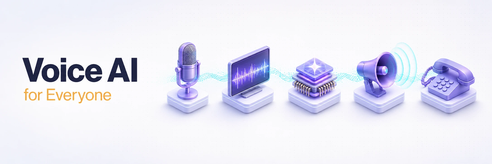

<picture>
<source media="(prefers-color-scheme: dark)" srcset="docs/assets/banner-dark.webp">
<source media="(prefers-color-scheme: light)" srcset="docs/assets/banner-light.webp">

</picture>

**一条精心整理的、面向开发者的学习路径：从第一次调用 STT，到把生产级电话语音智能体规模化上线。**

[English version](./README.md) · **中文版本**

语音智能体在不到三年里已从研究演示走进真实产品。**现代技术栈正收敛为一种清晰范式**：实时传输层（WebRTC 或电话网）、语音转文字 → 大语言模型 → 文字转语音的流式流水线，以及决定语音智能体何时开口的话轮模型。本清单的结构刻意贴近这一学习顺序——先打基础，再选框架，然后深入各组件与上线相关议题。

学习类资源标注为 **🟢 入门**、**🟡 进阶** 或 **🔴 高阶**（第 17-19 节的博客、播客与社区有意不作标注）。优先收录免费官方文档与厂商中立指南；**条目若存在商业背景会明确标注**。

---

## 如何使用本清单

若你是全新入门，建议自上而下阅读。推荐路径：

1. **基础** → 理解流水线与延迟预算
2. **框架** → 选定一个（开源最稳妥的选择是 LiveKit Agents 或 Pipecat），先跑通 hello-world
3. **组件**（STT、TTS、LLM、VAD、话轮检测）→ 替换各层以理解其作用
4. **传输与电话** → 对接真实电话号码
5. **评测、生产、伦理** → 把它做得足够安全、可以对外发布

---

## 📘 配套图书：《Voice Agents Handbook》

如果你想以更紧凑、有立场、面向生产的形式获得这些内容，可以阅读我撰写的 **[Voice Agents Handbook](https://handbook.mahimai.ca)**：基于 LiveKit 构建生产级语音 AI，附录涵盖技术栈选型与 LiveKit 生态中智能体之外的内容。现已在 Kindle 上架（同时提供纸质版）。

你正在读的 README 收录了本领域最好的免费资源，本书则是穿越这些资源的一条精选路径，融入了我在为技工、律师与移民顾问交付语音智能体过程中沉淀的模式。

> _披露：本仓库由我维护，《Voice Agents Handbook》也由我撰写。免费样章（前言 + 第 1 章）见 [handbook.mahimai.ca](https://handbook.mahimai.ca)。_

---

## 目录

<b>📖 展开全部 21 个章节</b>

1. [基础概念与学习路径](#1-基础概念与学习路径)
2. [框架与编排平台](#2-框架与编排平台)
3. [语音转文字（STT / ASR）](#3-语音转文字stt--asr)
4. [文字转语音（TTS）](#4-文字转语音tts)
5. [面向语音智能体与实时场景的 LLM](#5-面向语音智能体与实时场景的-llm)
6. [语音活动检测与话轮转换](#6-语音活动检测与话轮转换)
7. [音频增强与降噪](#7-音频增强与降噪)
8. [WebRTC 基础](#8-webrtc-基础)
9. [电话与 SIP](#9-电话与-sip)
10. [教程与动手项目](#10-教程与动手项目)
11. [GitHub 入门仓库与 Awesome 列表](#11-github-入门仓库与-awesome-列表)
12. [数据集与基准](#12-数据集与基准)
13. [对初学者友好的研究论文](#13-对初学者友好的研究论文)
14. [评测与测试](#14-评测与测试)
15. [生产、部署与扩展](#15-生产部署与扩展)
16. [伦理、安全与监管](#16-伦理安全与监管)
17. [博客与通讯](#17-博客与通讯)
18. [播客](#18-播客)
19. [社区](#19-社区)
20. [会议与活动](#20-会议与活动)
21. [黑客松与竞赛](#21-黑客松与竞赛)

---

## 1. 基础概念与学习路径

从这里开始。下列资源帮你建立**语音智能体流水线的心智模型**，以及职业生涯里会持续打交道的**延迟预算**。

- [语音智能体图解入门（Voice AI & Voice Agents）](https://voiceaiandvoiceagents.com/)：Kwindla Hultman Kramer 的免费、持续更新的长文入门书，可视为本领域的默认教材。**🟢 入门**
- [Voice Agent Architecture: STT, LLM, and TTS Pipelines Explained（LiveKit）](https://livekit.com/blog/voice-agent-architecture-stt-llm-tts-pipelines-explained)：图解流式模式、话轮检测及延迟主要落在哪些环节。**🟢 入门**
- [Everything You Need to Know About Voice AI Agents（Deepgram）](https://deepgram.com/learn/everything-about-voice-ai-agents)：端到端入门，涵盖特征提取、ASR、LLM 推理与合成。**🟢 入门**
- [AI Voice Agents（LiveKit 文档）](https://docs.livekit.io/agents/)：权威的「什么是语音智能体」参考，涵盖 Agents 框架、会话（session），以及 STT-LLM-TTS 流水线与实时模型两条路线的取舍。**🟢 入门**
- [Core Latency in AI Voice Agents（Twilio）](https://www.twilio.com/en-us/blog/developers/best-practices/guide-core-latency-ai-voice-agents)：图解话末检测、静音阈值与智能端点检测（endpointing）。**🟢 入门**
- [Advice on Building Voice AI in June 2025（Daily.co）](https://www.daily.co/blog/advice-on-building-voice-ai-in-june-2025/)：Pipecat 创始团队给出的 P50/P95 延迟预算实用建议。**🟡 进阶**
- [How Intelligent Turn Detection Solves the Biggest Challenge in Voice Agents（AssemblyAI）](https://www.assemblyai.com/blog/turn-detection-endpointing-voice-agent)：端点检测是最容易被低估的问题；本文是讲得最透的深度文之一。**🟡 进阶**

## 2. 框架与编排平台

下列框架都能把 STT、LLM 与 TTS 串起来。**若走开源生产路线，LiveKit Agents 与 Pipecat 通常是最稳妥的两款框架**；若偏好托管控制台，Vapi、Retell、Bland 在「从 0 到第一次通话」上非常省时。

### 开源框架

- [LiveKit Agents：语音智能体快速入门](https://docs.livekit.io/agents/start/voice-ai/)：约 10 分钟内用 Python 或 TypeScript 跑通一个语音智能体示例，底层为 WebRTC。**🟢 入门**
- [Pipecat：Quickstart](https://docs.pipecat.ai/getting-started/quickstart)：通过 Pipecat CLI（`uv tool install pipecat-ai-cli`，再 `pipecat init quickstart`）脚手架搭好 Deepgram + OpenAI + Cartesia 流水线；约 5 分钟内可在浏览器里对话。**🟢 入门**
- [Ultravox（fixie-ai/ultravox）](https://github.com/fixie-ai/ultravox)：开放权重的多模态语音 LLM（Llama/Gemma/Qwen 等变体），省去独立 ASR 环节，首 token 时延（TTFT）约 150 ms。**🔴 高阶**

### 托管平台

- [Vapi：Quickstart](https://docs.vapi.ai/quickstart/introduction)：以控制台为先；约 5 分钟内可在免费美国号码上发布语音智能体。**🟢 入门**
- [Retell AI：Introduction & Quickstart](https://docs.retellai.com/general/introduction)：电话语音智能体平台，注册送 $10 额度。**🟢 入门**
- [Bland AI：Send Your First Phone Call](https://www.bland.ai/blog/the-bland-ai-voice-call-api)：极简 API 教程，打出第一通 AI 电话。**🟢 入门**
- [ElevenLabs Agents：Quickstart](https://elevenlabs.io/docs/eleven-agents/quickstart)：约 5 分钟内在任意网站嵌入语音智能体组件（原名「Conversational AI」，现更名为 ElevenAgents）。**🟢 入门**

### 实时 / 语音到语音 API

- [OpenAI Realtime API：指南](https://platform.openai.com/docs/guides/realtime)：`gpt-realtime`（现已 GA）通过 WebRTC、WebSocket 或 SIP 接入的官方说明。**🟡 进阶**
- [Google Gemini Live API：概览](https://ai.google.dev/gemini-api/docs/live-api)：低延迟双向语音 + 视觉，支持插话（barge-in）与工具调用，基于 Gemini 3 原生音频。**🟡 进阶**
- [Twilio ConversationRelay](https://www.twilio.com/docs/voice/conversationrelay)：WebSocket 桥接，托管 STT/TTS，你专注 LLM 逻辑；可与任意 LLM 配合。**🟡 进阶**

### 厂商中立对比

- [Vapi vs Pipecat vs LiveKit（AssemblyAI）](https://www.assemblyai.com/blog/vapi-vs-pipecat-vs-livekit)：从架构视角对比流水线控制与传输选型。**🟡 进阶**
- [11 Voice Agent Platforms Compared（Softcery）](https://softcery.com/lab/choosing-the-right-voice-agent-platform-in-2025)：覆盖面广的市场地图与场景建议。**🟢 入门**
- [Best Voice Agent Stack（Hamming AI）](https://hamming.ai/resources/best-voice-agent-stack)：自研 vs 采购框架，含具体成本、延迟与上线周期数字。**🟡 进阶**

## 3. 语音转文字（STT / ASR）

**先选定一种流式 STT 并学深**，再四处比价。Deepgram、AssemblyAI 与 Whisper 衍生方案已覆盖多数场景。（像 Deepgram Flux 这类「ASR + 话末检测」一体化模型，参见[话轮转换](#6-语音活动检测与话轮转换)一节。）

### 商业 API

- [Deepgram Nova-3：STT 基准](https://deepgram.com/learn/speech-to-text-benchmarks)：在 WER、延迟与成本语境下介绍 Deepgram 产品；Nova-3 现已覆盖 36+ 种语言，并支持多语种混说（code-switching）。**🟢 入门**
- [AssemblyAI Universal-3 Pro](https://www.assemblyai.com/blog/build-voice-agent-function-calling)：流式 STT 教程，同时可作为 function calling 示例；Universal-3 Pro 为当前旗舰，新增自然语言关键术语提示（keyterm prompting）。**🟡 进阶**
- [OpenAI Whisper / gpt-4o-transcribe API 文档](https://platform.openai.com/docs/guides/speech-to-text)：若已用 OpenAI，这是最容易上手的云端 STT。**🟢 入门**
- [Soniox 多语言基准](https://soniox.com/benchmarks)：公开 WER，覆盖约 60 种语言。**🟢 入门**
- [Cartesia Ink 2](https://docs.cartesia.ai/build-with-cartesia/stt/latest)：流式 STT 搭配 Sonic TTS，单供应商低延迟栈。**🟢 入门**

### 开源

- [openai/whisper](https://github.com/openai/whisper)：原仓库与 DIY ASR 的事实起点。**🟢 入门**
- [SYSTRAN/faster-whisper](https://github.com/SYSTRAN/faster-whisper)：基于 CTranslate2 的实现，INT8 下可达约 4× 提速；自托管 Whisper 常用。**🟡 进阶**
- [NVIDIA NeMo（Parakeet / Canary）](https://github.com/NVIDIA-NeMo/NeMo)：榜单前列的开源 ASR 与流式推理方案。**🔴 高阶**
- [Moonshine](https://github.com/moonshine-ai/moonshine)：轻量端侧 ASR（tiny 27M / base 61M 参数）；v2 新增遍历式（ergodic）流式编码器，面向边缘设备上对延迟敏感的实时转写。**🟡 进阶**

### 基准与讲解

- [Open ASR Leaderboard（HuggingFace）](https://huggingface.co/spaces/hf-audio/open_asr_leaderboard)：社区榜单，11 个数据集；开源选型参考。**🟢 入门**
- [Artificial Analysis：Speech-to-Text](https://artificialanalysis.ai/speech-to-text)：独立榜单，按 WER、速度与成本排名 48+ 家 STT。**🟢 入门**
- [Best Speech-to-Text Providers in 2026（Coval）](https://www.coval.ai/blog/best-speech-to-text-providers-in-2026-independent-benchmarks-and-how-to-choose/)：横跨 14 家供应商的独立基准（WER、延迟、话末检测、成本），并指导如何用你自己的真实流量做测试。**🟡 进阶**
- [Best Speech-to-Text APIs in 2026（Deepgram）](https://deepgram.com/learn/best-speech-to-text-apis-2026)：供应商对比指南；注意作者为商业方。**🟢 入门**
- [Streaming vs Batch ASR（Arun Baby）](https://www.arunbaby.com/speech-tech/0001-streaming-asr/)：面向工程师的 RNN-T 与 Conformer 流式架构说明。**🟡 进阶**

## 4. 文字转语音（TTS）

**拖垮语音智能体的往往是延迟，而非单纯音质**——应优先选择真正的流式输出、首字节在 200 ms 以内的供应商。

### 商业 API

- [ElevenLabs 文档](https://elevenlabs.io/docs)：业界领先音质、声音克隆与 Agents 平台同属一套 SDK。**🟢 入门**
- [Cartesia Sonic Quickstart](https://docs.cartesia.ai/build-with-cartesia/tts-models/latest)：Sonic 3.5，首字节低于 90 ms，面向语音智能体设计。**🟢 入门**
- [Deepgram Aura-2](https://developers.deepgram.com/docs/tts-models)：低延迟流式 TTS（Aura-2），与 Deepgram STT 衔接顺畅。**🟢 入门**
- [OpenAI TTS（gpt-4o-mini-tts）](https://platform.openai.com/docs/guides/text-to-speech)：OpenAI 栈里最容易接入的 TTS。**🟢 入门**
- [Artificial Analysis：TTS 榜单](https://artificialanalysis.ai/text-to-speech/models)：ELO、价格与速度对比，含 Rime、PlayHT、Hume、Inworld 等。**🟢 入门**

### 开源

- [Chatterbox（resemble-ai/chatterbox）](https://github.com/resemble-ai/chatterbox)：Resemble AI 的 MIT 许可 TTS，在盲测偏好中胜过 ElevenLabs；约 5 秒零样本声音克隆、情感夸张度控制，并内置 PerTh 水印。Turbo 版（350M）首音频低于 150 ms；多语种版（V3，0.5B）覆盖 23+ 种语言。**🟡 进阶**
- [Kokoro 82M](https://github.com/hexgrad/kokoro)：体积小、Apache 许可，在社区 ELO 对战中表现突出；可跑 CPU。**🟢 入门**
- [Piper（OHF-Voice/piper1-gpl）](https://github.com/OHF-Voice/piper1-gpl)：面向树莓派等设备的快速本地神经 TTS，适合离线项目。**🟢 入门**
- [Coqui TTS（idiap fork）](https://github.com/idiap/coqui-ai-TTS)：Coqui-TTS / XTTS v2 的持续维护分支；依旧实战可靠，但在零样本克隆质量上现已被 Chatterbox 超越。**🟡 进阶**
- [Orpheus-TTS](https://github.com/canopyai/Orpheus-TTS)：基于 Llama-3B 的带情感 TTS，流式时延约 200 ms，支持情感标签。**🟡 进阶**
- [Sesame CSM](https://github.com/SesameAILabs/csm)：对话向、上下文感知的多说话人 TTS，Llama 骨干 + Mimi 编解码。**🔴 高阶**

### 流式与伦理

- [Streaming TTS for Low-Latency Agents（Picovoice）](https://picovoice.ai/blog/streaming-text-to-speech-for-ai-agents/)：清晰区分单流、输出流式与双流 TTS。**🟡 进阶**
- [Ethics of Voice Cloning & Deepfakes（Deepgram）](https://deepgram.com/learn/ethics-of-voice-cloning-and-deepfakes)：厂商中立讨论滥用、监管与开发者责任。**🟢 入门**

## 5. 面向语音智能体与实时场景的 LLM

用户感知的「是否聪明」很大程度上取决于 **LLM 能多快开始输出第一个 token**。首 token 时延（TTFT）低于约 300 ms 会显著改变对话体感。

### 低延迟推理

- [Groq](https://groq.com/)：LPU 推理云，Llama 吞吐相对常规 GPU 可达约 10×。**🟢 入门**
- [Cerebras Inference](https://www.cerebras.ai/inference)：晶圆级芯片推理，Llama 类模型吞吐很高。**🟢 入门**
- [SambaNova Cloud](https://cloud.sambanova.ai/)：可重构数据流架构上的推理服务；低延迟下吞吐稳定。**🟢 入门**

### 语音到语音模型

- [OpenAI Realtime API 指南](https://platform.openai.com/docs/guides/realtime)：旗舰级 S2S，传输为 WebRTC/WebSocket（`gpt-realtime`，现已 GA）。**🟡 进阶**
- [Google Gemini Live](https://ai.google.dev/gemini-api/docs/live-api)：实时多模态语音/视频，支持插话与广泛语言，基于 Gemini 3 原生音频。**🟡 进阶**
- [Moshi（kyutai-labs）](https://github.com/kyutai-labs/moshi)：开源全双工语音–文本基础模型（约 200 ms，Mimi 编解码）。Kyutai 更完整的技术栈现已包含 Unmute（级联 STT+LLM+TTS，支持工具调用）、Kyutai STT/TTS 与 Hibiki（流式翻译）。**🔴 高阶**
- [Speech-to-Speech Models in 2026: Three Architectural Bets（Krzysztof Sopyla）](https://ai.ksopyla.com/posts/voice-to-voice-models-2026-review/)：厂商中立对比全双工（Moshi）、近双工多模态（Qwen-Omni）与级联三种路线，附 FullDuplexBench 数据与取舍。**🟡 进阶**

### 面向语音智能体的提示与工具

- [OpenAI Voice Agents 指南](https://platform.openai.com/docs/guides/voice-agents)：对比链式 vs S2S 架构，含提示与工具最佳实践。**🟢 入门**
- [ElevenLabs Voice Agent Prompting 指南](https://elevenlabs.io/docs/eleven-agents/best-practices/prompting-guide)：面向语音智能体的生产级提示结构，经验可泛化。**🟡 进阶**
- [Voice AI Prompt Engineering Guide（VoiceInfra）](https://voiceinfra.ai/blog/voice-ai-prompt-engineering-complete-guide)：解释为何面向语音智能体的提示通常要比聊天场景短约 60–70%，附模板。**🟢 入门**
- [Tool Definition and Use for Voice Agents（LiveKit 文档）](https://docs.livekit.io/agents/logic/tools/definition/)：在语音智能体中定义 `@function_tool` 工具与原始 schema 工具。**🟡 进阶**

## 6. 语音活动检测与话轮转换

**仅靠传统 VAD 已不够**——现代方案往往把**声学 VAD**与预测话末的**小型语义模型**（结合用词与韵律）结合起来。

- [Silero VAD](https://github.com/snakers4/silero-vad)：MIT 许可的预训练 VAD；CPU 上每个音频处理块可低至 1 ms 以内。LiveKit 与 Pipecat 中的事实标准。**🟢 入门**
- [py-webrtcvad](https://github.com/wiseman/py-webrtcvad)：经典 Google WebRTC VAD 的 Python 绑定；轻量基线。**🟢 入门**
- [LiveKit Turn Detector 博文](https://livekit.com/blog/using-a-transformer-to-improve-end-of-turn-detection)：基于小型 Transformer 的话末（EOU）模型如何用语义补足 VAD。**🟡 进阶**
- [LiveKit turn-detector 模型（HuggingFace）](https://huggingface.co/livekit/turn-detector)：开放权重多语言 EOU 模型，CPU 上以 ONNX 运行，内存占用不足 500 MB。**🟡 进阶**
- [Deepgram Flux](https://deepgram.com/learn/fluxing-conversational-state-and-speech-to-text)：内置话末检测的一体化对话式 STT（话末检测中位数 <300 ms），与 Deepgram 的 Voice Agent API 集成；把 STT 与话轮检测合并到单个模型中。**🟡 进阶**
- [Pipecat Smart Turn v3](https://www.daily.co/blog/announcing-smart-turn-v3-with-cpu-inference-in-just-12ms/)：基于 Whisper-Tiny 的音频语义 VAD，CPU 上推理很快（按 v3 仓库，约 12 ms / 标准实例），BSD-2 许可。**🟡 进阶**
- [pipecat-ai/smart-turn](https://github.com/pipecat-ai/smart-turn)：模型代码、训练脚本与集成示例（约 8M 参数，Whisper-Tiny 基座）。**🟡 进阶**
- [Krisp Turn-Taking](https://krisp.ai/)：商业话轮模型，可与任意 STT/LLM/TTS 栈搭配使用。**🟡 进阶**
- [The Complete Guide to AI Turn-Taking（Tavus）](https://www.tavus.io/blog/ai-turn-taking)：易读总览：纯 VAD 为何在真实对话里失效。**🟢 入门**
- [Tackling Turn Detection in Voice AI（Notch）](https://www.notch.cx/post/turn-detection-in-voice-ai)：面向工程师的分步导读：VAD 概率、音量与 TTS 标记的组合。**🟡 进阶**
- [Evaluating End-of-Turn Detection Models（Deepgram）](https://deepgram.com/learn/evaluating-end-of-turn-detection-models)：方法论，并对 Flux、Pipecat Smart Turn 与 LiveKit EOU 做正面对比；注意作者为商业方。**🟡 进阶**
- [ai-coustics VAD](https://developers.ai-coustics.com/)：与实时语音增强、降噪与人声分离打包在同一个音频预处理 SDK 中的 VAD；当你需要同一个组件同时给出清洁后的音频与话轮信号时尤其合适。**🟢 入门**

## 7. 音频增强与降噪

进入 VAD 与 STT 的音频常常带有噪声、混响或多人声混叠。**在流水线的其他环节之前先把信号清干净**，往往是真实环境（车内、咖啡厅、呼叫中心）下「能上线的语音智能体」与「让用户失望的语音智能体」之间的分水岭。2026 年，每家主流语音 AI 厂商都会在 WebRTC 经典降噪链路之上再叠加一个深度学习降噪器。

- [ai-coustics](https://ai-coustics.com/)：实时语音增强 SDK，提供降噪、人声分离与 VAD；支持端侧与云端部署。参见[文档](https://docs.ai-coustics.com/)与[开发者平台](https://developers.ai-coustics.com/)。**🟢 入门**
- [Krisp SDK](https://krisp.ai/)：商业级实时降噪与背景人声消除；语音通信领域的事实标准（提供 Python、Node.js、Go、C++ SDK）。LiveKit 的背景人声消除与 Pipecat Cloud 均基于 Krisp。企业接入需通过联系表单。**🟢 入门**
- [DeepFilterNet（Rikorose/DeepFilterNet）](https://github.com/Rikorose/DeepFilterNet)：开源、低复杂度的全频带实时语音增强；可在嵌入式设备上运行。当前活跃开发中的最强开源降噪器。**🟡 进阶**
- [RNNoise（xiph/rnnoise）](https://github.com/xiph/rnnoise)：经典的 DSP + 深度学习混合降噪；体积小、易于理解的基线，但已不再活跃维护。**🟡 进阶**
- [Koala Noise Suppression（Picovoice）](https://picovoice.ai/platform/koala/)：端侧、跨平台的人声分离，自助接入（浏览器、移动端、桌面端、树莓派）。**🟢 入门**
- [Noise Suppression Guide 2026（Picovoice）](https://picovoice.ai/blog/complete-guide-to-noise-suppression/)：算法、可懂度指标（SII / STI / STOI）与实现取舍；注意作者为商业方。**🟡 进阶**

## 8. WebRTC 基础

对不走电话网的语音智能体，**WebRTC 是默认传输**。要做生产，**ICE、STUN、TURN 与 SFU 架构**不可不晓。

- [MDN WebRTC API](https://developer.mozilla.org/en-US/docs/Web/API/WebRTC_API)：`RTCPeerConnection`、`getUserMedia` 与信令的权威参考。**🟢 入门**
- [MDN：WebRTC 协议入门](https://developer.mozilla.org/en-US/docs/Web/API/WebRTC_API/Protocols)：ICE、STUN、TURN、SDP 的入门解释。**🟢 入门**
- [WebRTC.org Getting Started](https://webrtc.org/getting-started/overview)：Google 维护的官方介绍，将 WebRTC 拆为采集与连通。**🟢 入门**
- [GetStream：WebRTC for the Brave](https://getstream.io/resources/projects/webrtc/)：免费多模块教程，从网络基础到高阶主题。**🟢 入门**
- [Why WebRTC Beats WebSockets for Voice AI（LiveKit）](https://livekit.com/blog/why-webrtc-beats-websockets-for-voice-ai-agents)：2025 年面向语音智能体构建者的传输对比，用语通俗。**🟡 进阶**
- [Daily 文档：视频架构入门（P2P vs SFU）](https://docs.daily.co/guides/architecture-and-monitoring/intro-to-video-arch)：P2P 与 SFU 最清晰的新手文之一。**🟢 入门**
- [P2P, SFU, MCU, Hybrid: WebRTC Architecture Guide（Forasoft）](https://www.forasoft.com/blog/article/webrtc-architecture-guide-for-business-2026)：厂商中立的 2026 年四种架构拆解，含当前开源工具（mediasoup、Janus、Jitsi）。**🟡 进阶**
- [Agora：How WebRTC Works](https://www.agora.io/en/blog/how-does-webrtc-work/)：WebRTC 与 WebSocket 对照，附信令示意图。**🟢 入门**

## 9. 电话与 SIP

电话网与互联网链路上的语音**环境、协议与约束各不相同**。理清 **SIP 中继**如何接入你所用的语音栈（例如基于 LiveKit 或 Pipecat 的部署），才能稳定连接 PSTN。

- [Twilio Programmable Voice](https://www.twilio.com/en-us/voice)：TwiML、Voice API 与 PSTN 一站式；常见起点。**🟢 入门**
- [Twilio：Voice AI Assistant with OpenAI Realtime + Python](https://www.twilio.com/en-us/blog/voice-ai-assistant-openai-realtime-api-python)：分步教程，把 Twilio Media Streams 接到 LLM，对新手友好。**🟢 入门**
- [Twilio SIP Quickstart](https://www.twilio.com/docs/voice/sip/quickstart)：SIP 基础、SIP Domain 与软电话设置，入门最清楚。**🟢 入门**
- [Telnyx Voice API](https://telnyx.com/products/voice-api)：强有力的 Twilio 替代，含 WebSocket 媒体流与 AI Assistant 工具。**🟢 入门**
- [Telnyx：How to Set Up a SIP Trunk](https://support.telnyx.com/en/articles/8096455-how-to-configure-a-sip-trunk)：SIP trunk 架构、编解码与认证的友好说明。**🟢 入门**
- [Plivo Voice API 文档](https://www.plivo.com/docs/voice/)：XML 呼叫控制与面向语音智能体的音频流集成。**🟢 入门**
- [SignalWire Voice 文档](https://developer.signalwire.com/voice/)：基于 FreeSWITCH；SWML、类 TwiML API 与语音智能体 SDK（AI Agents SDK）。**🟡 进阶**
- [LiveKit SIP Primer](https://docs.livekit.io/reference/telephony/sip-primer/)：PSTN → 中继 → SIP 服务 → 语音智能体 的最佳示意图说明。**🟢 入门**
- [LiveKit SIP Trunk Setup](https://docs.livekit.io/telephony/start/sip-trunk-setup/)：将 Twilio/Telnyx/Plivo/Wavix/Sinch 中继接入 LiveKit 的实操。**🟡 进阶**
- [Pipecat Telephony Overview](https://docs.pipecat.ai/guides/telephony/overview)：基于 WebSocket 的电话与基于 SIP 的呼叫控制之差异。**🟡 进阶**

## 10. 教程与动手项目

**选定一篇教程并做完再开下一篇**。语音智能体对「半成品流水线」极不宽容。

- [LiveKit 语音智能体 Quickstart](https://docs.livekit.io/agents/start/voice-ai/)：官方约 10 分钟 Python/Node 教程与模板。**🟢 入门**
- [Build Your First AI Voice Agent in Python（LiveKit）](https://livekit.com/blog/build-your-first-ai-voice-agent-python)：端到端 Python：流式、延迟与部署。**🟢 入门**
- [Pipecat Quickstart](https://docs.pipecat.ai/getting-started/quickstart)：通过 Pipecat CLI 约 10 分钟搭好并部署 Deepgram + OpenAI + Cartesia 机器人。**🟢 入门**
- [How to Build a Real-Time Voice Agent with Pipecat（AssemblyAI）](https://www.assemblyai.com/blog/building-a-voice-agent-with-pipecat)：偏生产：本地测试与 Pipecat Cloud 部署。**🟡 进阶**
- [Build a Voice Agent with LiveKit（AssemblyAI）](https://www.assemblyai.com/blog/build-voice-agent-livekit)：端到端串联 LiveKit Agents + AssemblyAI Universal-3 Pro + Cartesia，先本地运行再上 Agents Playground。**🟡 进阶**
- [Deepgram：Build a Voice AI Agent](https://deepgram.com/learn/how-to-build-a-voice-ai-agent)：分步串联 Deepgram STT、GPT 与 Aura TTS。**🟢 入门**
- [Build a Voice Assistant with Twilio ConversationRelay + LiteLLM](https://www.twilio.com/en-us/blog/developers/tutorials/product/voice-ai-assistant-conversationrelay-litellm-python)：供应商无关，可接 OpenAI、Anthropic 或 DeepSeek。**🟡 进阶**
- [freeCodeCamp：Build Advanced AI Agents（LiveKit, Exa, LangChain）](https://www.youtube.com/watch?v=B0TJC4lmzEM)：免费三部分视频，端到端交互式语音智能体。**🟢 入门**
- [freeCodeCamp：Build a Voice AI Agent with Open-Source Tools](https://www.freecodecamp.org/news/how-to-build-a-voice-ai-agent-using-open-source-tools/)：动手搭建本地栈，涵盖开源 STT、本地 LLM 与系统 TTS，并讨论级联 vs 端到端的取舍。**🟡 进阶**

## 11. GitHub 入门仓库与 Awesome 列表

与其从零写样板，不如直接 clone。

- [livekit/agents](https://github.com/livekit/agents)：旗舰级开源 Python/Node 生产语音智能体框架（小贴士：搭配 LiveKit Docs MCP server 与 Agent Skill 可获得 AI 辅助开发）。**🟢 → 🔴**
- [pipecat-ai/pipecat](https://github.com/pipecat-ai/pipecat)：厂商中立，含 40+ STT/LLM/TTS 服务插件。**🟢 → 🔴**
- [livekit-examples/agent-starter-python](https://github.com/livekit-examples/agent-starter-python)：生产向 starter：Dockerfile、评测套件、话轮检测与核心插件。**🟢 入门**
- [livekit-examples（组织）](https://github.com/livekit-examples)：LiveKit 官方 Python/React/Swift/Android 示例集合。**🟢 入门**
- [pipecat-ai/pipecat-examples](https://github.com/pipecat-ai/pipecat-examples)：按键说话、WebSocket、电话与多模态等示例。**🟢 → 🟡**
- [elevenlabs/elevenlabs-examples](https://github.com/elevenlabs/elevenlabs-examples)：可运行的 Next.js 与 Python 示例：TTS、STT 与实时语音智能体。**🟢 入门**
- [kwindla/macos-local-voice-agents](https://github.com/kwindla/macos-local-voice-agents)：Pipecat 示例：在 M 系列 Mac 上全本地实现端到端语音延迟低于 800 ms。**🟡 进阶**
- [zzw922cn/awesome-speech-recognition-speech-synthesis-papers](https://github.com/zzw922cn/awesome-speech-recognition-speech-synthesis-papers)：ASR、TTS、声音转换与语音–LLM 论文索引。**🟡 进阶**
- [wildminder/awesome-ai-voice](https://github.com/wildminder/awesome-ai-voice)：活跃维护的 2026 年开源 TTS、声音克隆与音频/音乐生成模型列表。**🟢 入门**

## 12. 数据集与基准

你很少从零训练，但**模型在哪些数据上训练**决定了口音、语言与典型失效模式。

- [LibriSpeech ASR Corpus](https://www.openslr.org/12)：约 1,000 小时英语有声书；大量 ASR 论文以此为基准。**🟢 入门**
- [Mozilla Common Voice](https://commonvoice.mozilla.org/)：众包多语言（100+）；合法微调 ASR 的最易得途径之一。**🟢 入门**
- [Common Voice on HuggingFace](https://huggingface.co/datasets/mozilla-foundation/common_voice_17_0)：一行 `load_dataset()` 做实验。官方 `mozilla-foundation` 版本最高到 v17 左右；更新的语料版本（最高 v22）托管在社区镜像上。**🟢 入门**
- [Open ASR Leaderboard](https://huggingface.co/spaces/hf-audio/open_asr_leaderboard)：60+ 模型在 WER 与实时因子上的在线对比。**🟢 入门**
- [Artificial Analysis：Speech](https://artificialanalysis.ai/speech-to-text)：商业 STT/TTS 的独立基准。**🟢 入门**
- [LJSpeech Dataset](https://keithito.com/LJ-Speech-Dataset/)：约 24 小时单说话人英语；Tacotron 2、VITS 等常用语料。**🟢 入门**
- [VCTK Corpus](https://datashare.ed.ac.uk/handle/10283/3443)：约 110 位英语说话人，口音多样；多说话人 TTS 常用。**🟡 进阶**
- [VoxCeleb（Oxford VGG）](https://www.robots.ox.ac.uk/~vgg/data/voxceleb/)：百万级「野外」语句，用于说话人识别与验证。**🟡 进阶**

## 13. 对初学者友好的研究论文

这些是**你实际会用到的模型背后的里程碑论文**。建议先看 Whisper 与 Common Voice 两篇——文笔在机器学习论文里算格外友好。

- [Whisper：Robust Speech Recognition via Large-Scale Weak Supervision（2022）](https://arxiv.org/abs/2212.04356)：最流行的开源 ASR 背后；行文比一般 ML 论文清晰。**🟡 进阶**
- [HuggingFace Whisper 微调博文（配套）](https://huggingface.co/blog/fine-tune-whisper)：动手走一遍，用代码「感受」Whisper 论文。**🟢 入门**
- [VITS：Conditional VAE with Adversarial Learning for End-to-End TTS（2021）](https://arxiv.org/abs/2106.06103)：许多开源声音克隆器背后的单阶段 TTS。**🟡 进阶**
- [Tacotron 2：Natural TTS Synthesis（2017）](https://arxiv.org/abs/1712.05884)：seq2seq + WaveNet 声码器的里程碑论文，让神经 TTS 听起来自然。**🟡 进阶**
- [Conformer：Convolution-augmented Transformer for ASR（2020）](https://arxiv.org/abs/2005.08100)：NVIDIA Parakeet、Canary 及诸多榜单模型内部架构。**🟡 进阶**
- [wav2vec 2.0：Self-Supervised Learning of Speech Representations（2020）](https://arxiv.org/abs/2006.11477)：证明在无标注音频上预训练可大幅减少标注数据需求。**🟡 进阶**
- [Common Voice：A Massively-Multilingual Speech Corpus（2020）](https://arxiv.org/abs/1912.06670)：短文，易读，说明 Common Voice 如何构建与校验。**🟢 入门**
- [Moshi: A Speech-Text Foundation Model for Real-Time Dialogue（2024）](https://arxiv.org/abs/2410.00037)：首个实时全双工口语 LLM；提出 Mimi 编解码与「内心独白」（Inner Monologue，在音频 token 之前对齐输出时间戳文本）方法。**🔴 高阶**
- [Open ASR Leaderboard preprint（2025）](https://arxiv.org/abs/2510.06961)：60+ 模型、11 个数据集的可复现基准；可作为当前开源 ASR 格局的全景参考。**🟡 进阶**
- [Full-Duplex-Bench: Evaluating Full-Duplex Spoken Dialogue Models on Turn-Taking（2025）](https://arxiv.org/abs/2503.04721)：用于评测语音到语音模型中打断处理与话轮转换的可复现基准。**🟡 进阶**

## 14. 评测与测试

不能度量就无法交付。**语音智能体评测本质上带有随机性**——同一转写在不同次运行中可能过也可能不过，因此**仿真与统计**比固定用例更重要。

- [Coval：Voice AI Testing Platform](https://www.coval.ai/)：定义核心指标：TTFB、WER、解决率、仿真口音与打断等。**🟢 入门**
- [Coval：How to Evaluate Voice Agents（实用指南）](https://www.coval.ai/blog/how-to-evaluate-voice-agents-a-practical-guide-to-testing-and-quality-assurance)：2025 年常被引用的概率 vs 确定性评测指南。**🟢 入门**
- [Cekura：Metrics Overview](https://docs.cekura.ai/documentation/key-concepts/metrics/overview)：预定义指标、指令遵循检查与仿真框架。**🟢 入门**
- [Cekura：Performance Testing for Voice Agents](https://www.cekura.ai/blogs/performance-testing-voice-agents-practical-guide-cekura)：2025 实用文：多轮仿真与边界用例生成。**🟡 进阶**
- [Hamming AI](https://hamming.ai/)：生产向 QA：仿真、负载测试与 50+ 指标。**🟡 进阶**
- [Hamming：Voice Agent Evaluation Metrics Guide](https://hamming.ai/resources/voice-agent-evaluation-metrics-guide)：延迟百分位数、WER、类 MOS 质量与任务完成率及计算公式。**🟡 进阶**
- [LiveKit：Understand and Improve Agent Latency](https://livekit.com/blog/understand-and-improve-agent-latency)：每轮延迟（端到端、LLM TTFT、TTS TTFB）与优化切入点。**🟡 进阶**
- [Twilio：How Do You Know if Your Voice AI Agents Are Working?](https://www.twilio.com/en-us/blog/developers/evaluating-voice-ai-agents)：2025 厂商中立文：主张业务结果指标优于单纯 WER/延迟。**🟢 入门**
- [Future AGI simulate-sdk](https://github.com/future-agi/simulate-sdk)：开源语音 AI 仿真 SDK，用于测试 AI 智能体；可生成合成对话用于评测。**🟡 进阶**
- [Future AGI](https://github.com/future-agi/future-agi)：开源平台，在同一反馈闭环中对语音与 AI 智能体应用进行仿真、评测、追踪、护栏与优化；支持基于人物画像的仿真与 50+ 评测指标。**🟡 进阶**

## 15. 生产、部署与扩展

语音智能体的生产级基础设施**仍是本领域最难且未完全标准化的问题**。在给人报「每分钟多少钱」之前，建议先读这些。

- [LiveKit：Deploy and scale agents on LiveKit Cloud](https://livekit.com/blog/deploy-and-scale-agents-on-livekit-cloud/)：有状态负载均衡、自动扩缩与预热池等实战经验。**🟡 进阶**
- [LiveKit：Why You Shouldn't Build Voice Agents Directly on Model APIs](https://livekit.com/blog/real-time-voice-agents-vs-model-apis)：坦率说明「裸调模型 API」缺什么。**🟡 进阶**
- [Latent Space：OpenAI Realtime API: The Missing Manual](https://www.latent.space/p/realtime-api)：Pipecat 作者基于一线经验，揭开 Realtime API 在生产环境中的真实面貌。**🟡 进阶**
- [TWIML：Building Voice AI Agents That Don't Suck（Kwindla Kramer）](https://twimlai.com/podcast/twimlai/building-voice-ai-agents-that-dont-suck)：约一小时，谈真实生产架构与话轮。**🟡 进阶**
- [AWS：Voice Agents with Pipecat and Amazon Bedrock](https://aws.amazon.com/blogs/machine-learning/building-intelligent-ai-voice-agents-with-pipecat-and-amazon-bedrock-part-1/)：完整架构含延迟优化与 Nova Sonic。**🟡 进阶**
- [Deepgram：STT API Pricing Breakdown](https://deepgram.com/learn/speech-to-text-api-pricing-breakdown-2025)：各家每分钟经济性——签合同前必读。**🟢 入门**
- [Sierra：Shipping and Scaling AI Agents](https://sierra.ai/blog/shipping-and-scaling-ai-agents)：Sonos、SiriusXM、OluKai 等语音智能体部署案例。**🟡 进阶**
- [Sierra：Constellation of Models](https://sierra.ai/blog/constellation-of-models)：领先客户体验（CX）公司如何在单个语音智能体里组合 15+ 模型。**🟡 进阶**
- [LiveKit Agent Observability](https://livekit.com/products/agent-observability)：LiveKit Cloud 内置追踪、转写与各阶段延迟。**🟢 入门**

## 16. 伦理、安全与监管

若在 2026 年对外发布语音智能体，**披露与同意已不再是可选项**。FCC 与欧盟《人工智能法》均有实质约束力。

- [FCC：AI-Generated Voices in Robocalls Illegal（2024 年 2 月）](https://www.fcc.gov/document/fcc-makes-ai-generated-voices-robocalls-illegal)：TCPA 里程碑裁定，美国语音智能体开发者应读。**🟢 入门**
- [EU AI Act：Article 50（深度伪造与 AI 交互的透明度）](https://artificialintelligenceact.eu/article/50/)：欧盟披露规则权威条文；透明度义务自 2026 年 8 月 2 日起适用（在此日期前已上市的系统可延至 2026 年 12 月 2 日合规）。**🟡 进阶**
- [European Commission：Code of Practice on AI-Generated Content](https://digital-strategy.ec.europa.eu/en/policies/code-practice-ai-generated-content)：官方实施指引：水印与标注；最终版《行为准则》已于 2026 年 6 月 10 日发布。**🟡 进阶**
- [FTC：Approaches to Address AI-Enabled Voice Cloning](https://www.ftc.gov/policy/advocacy-research/tech-at-ftc/2024/04/approaches-address-ai-enabled-voice-cloning)：通俗总结 Voice Cloning Challenge 与冒充规则。**🟢 入门**
- [FTC：拟议的 AI 个人冒充规则（2024 年 2 月）](https://www.ftc.gov/news-events/news/press-releases/2024/02/ftc-proposes-new-protections-combat-ai-impersonation-individuals)：美国冒充欺诈规则的一手来源，涵盖 AI 深度伪造。**🟢 入门**
- [Pindrop：Voice Intelligence & Security Report](https://www.pindrop.com/research/report/voice-intelligence-security-report/)：行业报告：深度伪造诈骗尝试急剧上升。**🟢 入门**
- [Voice Cloning Ethics（CAMB.AI）](https://www.camb.ai/blog-post/voice-cloning-ethics-consent-deepfakes-responsible-ai-voice-use)：同意框架、ELVIS 法案与欧盟 AI 法的实践概览。**🟢 入门**
- [NCLC：Top Six TCPA/Robocall Developments 2024/2025](https://library.nclc.org/article/top-six-tcparobocall-developments-20242025)：消费者保护视角看实际执法重点。**🟡 进阶**

## 17. 博客与通讯

订阅两三份即可跟上节奏——领域变化很快。

- [LiveKit Blog](https://livekit.com/blog/)：WebRTC、语音智能体框架发布与生产实践方面的深度技术文章。
- [Deepgram Learn](https://deepgram.com/learn)：STT/TTS、语音智能体设计、评测与流水线架构教程。
- [Cartesia Blog](https://cartesia.ai/blog)：状态空间 TTS、Sonic 发布与年度「State of Voice AI」。
- [ElevenLabs Blog](https://elevenlabs.io/blog)：产品与研发公告及实现笔记。
- [Daily.co Blog（Pipecat）](https://www.daily.co/blog/)：Pipecat 维护者关于扩展与功能的文章。
- [Voice AI & Voice Agents：图解入门](https://voiceaiandvoiceagents.com/)：免费、持续更新的长文入门。
- [Voice AI Space](https://www.voiceaispace.com/)：厂商中立的语音 AI 生态枢纽：精选产品与工具目录、Voice AI Newsroom、教程与仓库、招聘版块以及社区聚会。
- [Voice AI Newsletter（Krisp）](https://voice-ai-newsletter.krisp.ai/)：「Future of Voice AI」创始人访谈系列。
- [Voice AI Weekly（Vapi）](https://vapivoice.substack.com/)：周报：新闻、产品与工具汇总。

## 18. 播客

- [Deepgram AI Minds](https://deepgram.com/podcast)：语音 AI 生态中的创始人与开发者访谈。
- [The Future of Voice AI（Krisp）](https://podcasts.apple.com/us/podcast/the-future-of-voice-ai/id1809847184)：每周创始人访谈，侧重企业语音智能体架构。
- [TWIML AI Podcast：语音相关单集](https://podcasts.apple.com/us/podcast/building-voice-ai-agents-that-dont-suck-with-kwindla-kramer/id1116303051?i=1000717421464)：技术访谈质量高；Kwindla Kramer 集适合入门。
- [This Week In Voice（Project Voice）](https://thisweekinvoice.substack.com/)：新闻圆桌，覆盖对话式 AI 与语音智能体。

## 19. 社区

- [LiveKit Community Slack](https://livekit.io/join-slack)：直接联系维护者与其他语音智能体开发者。
- [Pipecat Discord](https://discord.com/invite/pipecat)：活跃社区与每周线上答疑；邀请链接在主页。
- [HuggingFace Discord：#ml-for-audio-and-speech](https://hf.co/join/discord)：约 20 万成员的社区，音频与语音相关频道讨论活跃。
- [Vapi Discord](https://discord.com/invite/mGpJhPkU5Y)：Vapi 语音智能体构建者社区；邀请在主页。
- [Retell AI Community](https://community.retellai.com/?_gl=1*11wnryf*_gcl_au*MTg0MzA5NjAxOC4xNzgxNjQzMTU5)：面向 Retell 开发者的论坛，侧重电话语音智能体。
- [ElevenLabs Discord](https://discord.gg/elevenlabs)：大社区：TTS、声音克隆与 Conversational AI，每日互助帖。
- [Deepgram Discord](https://discord.com/invite/deepgram)：STT/TTS 与语音智能体 API 支持与共建讨论。
- [Reddit：r/LocalLLaMA](https://www.reddit.com/r/LocalLLaMA/)：本地 Whisper/Parakeet、端侧 TTS 与端到端语音栈讨论活跃。
- [Reddit：r/AI_Agents](https://www.reddit.com/r/AI_Agents/)：通用 AI 智能体社区，语音智能体相关话题常见。

## 20. 会议与活动

- [AI Engineer World's Fair](https://www.ai.engineer/worldsfair)：规模最大的 AI 工程会议；语音智能体分论坛曾有 ElevenLabs、Vapi、LiveKit、Pipecat、Cartesia 等重大发布。2026 年将于 6 月 29 日至 7 月 2 日在旧金山 Moscone West 举办。
- [AI Engineer YouTube 频道](https://www.youtube.com/@aiDotEngineer)：World's Fair 与 Summit 演讲免费上线，语音智能体相关演讲的优质资源库。
- [AI Engineer Summit Online：语音播放列表](https://www.youtube.com/playlist?list=PLcfpQ4tk2k0VetQVGT1EqTbcr-qcgbfFs)：精选 YouTube 播放列表，含领先实验室的语音智能体相关场次。
- [AIEWF 2025 Recap（Latent Space）](https://www.latent.space/p/aiewf-2025-keynotes)：2025 语音智能体分论坛与重要发布的长文复盘。
- [VOICE & AI（Modev）](https://www.voicesummit.ai/)：长期聚焦语音智能体与语音技术的会议，覆盖更广的客户体验与语音机器人，将于 2026 年 10 月 5–7 日举办。
- [Interspeech 2026](https://interspeech2026.org/)：语音科学顶会；门槛高但值得关注，大量里程碑论文首发于此。澳大利亚悉尼，2026 年 9 月 27 日至 10 月 1 日。

## 21. 黑客松与竞赛

- [ElevenHacks（每周冲刺）](https://hacks.elevenlabs.io/)：每周主题挑战，含额度与奖品；低压力「一周一项目」。**🟢 入门**
- [AI Engineer World's Fair Hackathon](https://cerebralvalley.ai/e/aiewf-hackathon-2026)：与大会同期；$10K 奖金，3000+ AI 工程师评审，语音智能体相关项目与竞赛活跃，将于 6 月 27 日上午 9:00 至 6 月 28 日下午 5:00（PDT）举办。**🟡 进阶**
- [lablab.ai AI Hackathons](https://lablab.ai/event)：持续更新的短期线上黑客松日历，常有语音智能体厂商赞助。**🟢 入门**
- [Devpost：Voice AI Hackathons](https://devpost.com/hackathons?search=voice+ai)：集中检索进行中的语音智能体黑客松。**🟢 入门**

---

## 建议学习路径

1. **第 1 周——基础：** 阅读 LiveKit 流水线文章与《语音智能体图解入门》（第 1、8 节）。
2. **第 2 周——首个语音智能体：** 完整跑通 LiveKit _或_ Pipecat 快速入门（第 2、10 节）。
3. **第 3 周——组件：** 替换 STT、TTS、LLM 供应商；对延迟做基准测试（第 3、4、5 节）。
4. **第 4 周，话轮、音频清洗与电话：** 接入 Silero VAD、话轮检测以及一道语音增强；配置并接通 SIP 中继（第 6、7、9 节）。
5. **第 5 周——生产：** 加入评测与可观测性；阅读 FCC/欧盟 AI 法材料（第 14、15、16 节）。
6. **持续：** 订阅两封通讯、关注 Voice AI Space，并加入语音智能体相关社区，例如 [LinkedIn 群组](https://www.linkedin.com/groups/14269127/)（第 17、18、19 节）。

## 贡献

欢迎 Pull Request。资源须**在近 12 个月内仍活跃**、**对开发者可访问**，且为**厂商中立或由商业方撰写时已明确标注**。若要增删条目，也可开 issue 建议。完整贡献指南见 [CONTRIBUTING.md](CONTRIBUTING.md)。

## ⭐ Stargazers 与贡献者

## 📜 许可证

[MIT](LICENSE)。自由 fork，自由发布。
