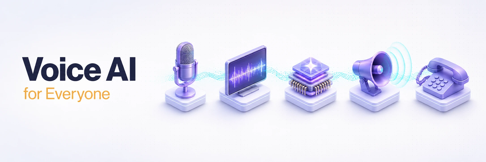

<picture>
<source media="(prefers-color-scheme: dark)" srcset="docs/assets/banner-dark.webp">
<source media="(prefers-color-scheme: light)" srcset="docs/assets/banner-light.webp">

</picture>

**一条精心整理的、面向开发者的学习路径：从第一次调用 STT，到把生产级电话语音智能体规模化上线。**

[English version](./README.md) · **中文版本**

语音智能体在不到三年里已从研究演示走进真实产品。**现代技术栈正收敛为一种清晰范式**：实时传输层（WebRTC 或电话网）、语音转文字 → 大语言模型 → 文字转语音的流式流水线，以及决定语音智能体何时开口的话轮模型。本清单的结构刻意贴近这一学习顺序：先打基础，再选框架，然后深入各组件与上线相关议题。

学习类资源标注为 **🟢 入门**、**🟡 进阶** 或 **🔴 高阶**（第 17-20 节的博客、播客、社区与会议有意不作标注）。优先收录免费官方文档与厂商中立指南；**条目若存在商业背景会明确标注**。

---

## 如何使用本清单

若你是全新入门，建议自上而下阅读。推荐路径：

1. **基础** → 理解流水线与延迟预算
2. **框架** → 选定一个（开源最稳妥的选择是 LiveKit Agents 或 Pipecat），先跑通 hello-world
3. **组件**（STT、TTS、LLM、VAD、话轮检测）→ 替换各层以理解其作用
4. **传输与电话** → 对接真实电话号码
5. **评测、生产、伦理** → 把它做得足够安全、可以对外发布

---

## 📘 配套图书：《Voice Agents Handbook》

如果你想以更紧凑、有立场、面向生产的形式获得这些内容，可以阅读我撰写的 **[Voice Agents Handbook](https://handbook.mahimai.ca)**：基于 LiveKit 构建生产级语音 AI，附录涵盖技术栈选型与 LiveKit 生态中智能体之外的内容。现已在 Kindle 上架（同时提供纸质版）。

你正在读的 README 收录了本领域最好的免费资源，本书则是穿越这些资源的一条精选路径，融入了我在为技工、律师与移民顾问交付语音智能体过程中沉淀的模式。

> _披露：本仓库由我维护，《Voice Agents Handbook》也由我撰写。免费样章（前言 + 第 1 章）见 [handbook.mahimai.ca](https://handbook.mahimai.ca)。_

---

## 目录

<b>📖 展开全部 21 个章节</b>

1. [基础概念与学习路径](#-1-基础概念与学习路径)
2. [框架与编排平台](#-2-框架与编排平台)
3. [语音转文字（STT / ASR）](#-3-语音转文字stt--asr)
4. [文字转语音（TTS）](#-4-文字转语音tts)
5. [面向语音智能体与实时场景的 LLM](#-5-面向语音智能体与实时场景的-llm)
6. [语音活动检测与话轮转换](#-6-语音活动检测与话轮转换)
7. [音频增强与降噪](#-7-音频增强与降噪)
8. [WebRTC 基础](#-8-webrtc-基础)
9. [电话与 SIP](#-9-电话与-sip)
10. [教程与动手项目](#-10-教程与动手项目)
11. [GitHub 入门仓库与 Awesome 列表](#-11-github-入门仓库与-awesome-列表)
12. [数据集与基准](#-12-数据集与基准)
13. [对初学者友好的研究论文](#-13-对初学者友好的研究论文)
14. [评测与测试](#-14-评测与测试)
15. [生产、部署与扩展](#-15-生产部署与扩展)
16. [伦理、安全与监管](#-16-伦理安全与监管)
17. [博客与通讯](#-17-博客与通讯)
18. [播客](#-18-播客)
19. [社区](#-19-社区)
20. [会议与活动](#-20-会议与活动)
21. [黑客松与竞赛](#-21-黑客松与竞赛)

---

## 🧭 1. 基础概念与学习路径

从这里开始。下列资源帮你建立**语音智能体流水线的心智模型**，以及职业生涯里会持续打交道的**延迟预算**。

<b>6 项资源</b>

- 🟢 [语音智能体图解入门（Voice AI & Voice Agents）](https://voiceaiandvoiceagents.com/)：Kwindla Hultman Kramer 的免费、持续更新的长文入门书，可视为本领域的默认教材。
- 🟢 [Voice Agent Architecture: STT, LLM, and TTS Pipelines Explained（LiveKit）](https://livekit.com/blog/voice-agent-architecture-stt-llm-tts-pipelines-explained)：图解流式模式、话轮检测及延迟主要落在哪些环节。
- 🟢 [Everything You Need to Know About Voice AI Agents（Deepgram）](https://deepgram.com/learn/everything-about-voice-ai-agents)：端到端入门，涵盖特征提取、ASR、LLM 推理与合成。
- 🟢 [AI Voice Agents（LiveKit 文档）](https://docs.livekit.io/agents/)：权威的「什么是语音智能体」参考，涵盖 Agents 框架、会话（session），以及 STT-LLM-TTS 流水线与实时模型两条路线的取舍。
- 🟢 [Core Latency in AI Voice Agents（Twilio）](https://www.twilio.com/en-us/blog/developers/best-practices/guide-core-latency-ai-voice-agents)：图解话末检测、静音阈值与智能端点检测（endpointing）。
- 🟡 [How Intelligent Turn Detection Solves the Biggest Challenge in Voice Agents（AssemblyAI）](https://www.assemblyai.com/blog/turn-detection-endpointing-voice-agent)：端点检测是最容易被低估的问题；本文是讲得最透的深度文之一。

## 🧩 2. 框架与编排平台

下列框架都能把 STT、LLM 与 TTS 串起来。**若走开源生产路线，LiveKit Agents 与 Pipecat 通常是最稳妥的两款框架**；若偏好托管控制台，Vapi、Retell、Bland 在「从 0 到第一次通话」上非常省时。

| 推荐 | 类型 | 适合 |
|------|------|------|
| **LiveKit Agents** | 开源 | 生产、WebRTC 原生 |
| **Pipecat** | 开源 | 厂商中立的流水线 |
| **Vapi / Retell / Bland** | 托管 | 最快打通第一通电话 |
| **OpenAI Realtime / GPT-Live / Gemini Live** | 实时 API | 语音到语音 |

<b>16 项资源</b>

### 开源框架

- 🟢 [LiveKit Agents：语音智能体快速入门](https://docs.livekit.io/agents/start/voice-ai/)：约 10 分钟内用 Python 或 TypeScript 跑通一个语音智能体示例，底层为 WebRTC。
- 🟢 [Pipecat：Quickstart](https://docs.pipecat.ai/pipecat/get-started/quickstart)：通过 Pipecat CLI（`uv tool install "pipecat-ai[cli]"`，再 `pipecat init quickstart`）脚手架搭好 Deepgram + OpenAI + Cartesia 流水线；约 5 分钟内可在浏览器里对话。
- 🔴 [Ultravox（fixie-ai/ultravox）](https://github.com/fixie-ai/ultravox)：开放权重的语音 LLM（Whisper 编码器接入 LLM 骨干；v0.7 基于 GLM-4.6，早期版本基于 Llama、Gemma、Qwen），省去独立 ASR 环节。
- 🟡 [qwen-audio-agent](https://github.com/QwenAudio/qwen-audio-agent)：全双工语音运行时，通过 ACP 驱动编码智能体（OpenCode、Claude Code、Codex 等），支持自然打断、后台任务并行与本地唤醒词。
- 🟡 [TEN Framework](https://github.com/TEN-framework/ten-framework)：面向实时多模态（语音、视频、文本）智能体的开源框架，ASR、LLM 与 TTS 以扩展形式可插拔；许可为 Apache 2.0 附加限制条款，由 Agora 支持。
### 托管平台

- 🟢 [Vapi：Quickstart](https://docs.vapi.ai/quickstart/introduction)：以控制台为先；约 5 分钟内可在免费美国号码上发布语音智能体。
- 🟢 [Retell AI：Introduction & Quickstart](https://docs.retellai.com/general/introduction)：电话语音智能体平台，注册送 $10 额度。
- 🟢 [Bland AI：Send Your First Phone Call](https://www.bland.ai/blog/the-bland-ai-voice-call-api)：极简 API 教程，打出第一通 AI 电话。
- 🟢 [ElevenLabs Agents：Quickstart](https://elevenlabs.io/docs/eleven-agents/quickstart)：约 5 分钟内在任意网站嵌入语音智能体组件（原名「Conversational AI」，现更名为 ElevenAgents）。
### 实时 / 语音到语音 API

- 🟡 [OpenAI Realtime API：指南](https://developers.openai.com/api/docs/guides/realtime)：`gpt-realtime-2.1` 与 `gpt-realtime-2.1-mini`（GA；可配置推理）通过 WebRTC、WebSocket 或 SIP 接入的官方说明。
- 🟡 [OpenAI GPT-Live：指南](https://developers.openai.com/api/docs/guides/live)：全双工语音模型（`gpt-live-1`），可同时听与说、自行决定何时让出或打断，并把推理与工具调用交给后端文本模型；支持 WebRTC、WebSocket 或 SIP 接入。
- 🟡 [Google Gemini Live API：概览](https://ai.google.dev/gemini-api/docs/live-api)：低延迟双向语音 + 视觉，支持插话（barge-in）与工具调用，基于 `gemini-3.8-live`（另有 Extended Thinking 版本）。
- 🟡 [Twilio ConversationRelay](https://www.twilio.com/docs/voice/conversationrelay)：WebSocket 桥接，托管 STT/TTS，你专注 LLM 逻辑；可与任意 LLM 配合。
### 厂商中立对比

- 🟡 [Vapi vs Pipecat vs LiveKit（AssemblyAI）](https://www.assemblyai.com/blog/vapi-vs-pipecat-vs-livekit)：从架构视角对比流水线控制与传输选型。
- 🟢 [12 Voice Agent Platforms Compared（Softcery）](https://softcery.com/lab/choosing-the-right-voice-agent-platform-in-2026)：覆盖面广的 2026 年市场地图与场景建议；注意作者为商业机构（开发服务商）。
- 🟡 [Best Voice Agent Stack（Hamming AI）](https://hamming.ai/resources/best-voice-agent-stack)：自研 vs 采购框架，含具体成本、延迟与上线周期数字。

## 🎧 3. 语音转文字（STT / ASR）

**先选定一种流式 STT 并学深**，再四处比价。Deepgram、AssemblyAI 与 Whisper 衍生方案已覆盖多数场景。（像 Deepgram Flux 这类「ASR + 话末检测」一体化模型，参见[话轮转换](#-6-语音活动检测与话轮转换)一节。）

| 推荐 | 类型 | 适合 |
|------|------|------|
| **Deepgram Nova-3** | 商业 | 通用，36+ 种语言 |
| **AssemblyAI Universal-3.5 Pro** | 商业 | 准确率、话者分离 |
| **Speechmatics Agent STT** | 商业 | 智能体话轮：姓名、数字 |
| **Soniox** | 商业 | 多语言 + 内置翻译 |
| **faster-whisper** | 开源 | 自托管 Whisper |
| **NVIDIA Parakeet（NeMo）** | 开源 | 榜单前列准确率 |

<b>25 项资源</b>

### 商业 API

- 🟢 [Deepgram Nova-3：STT 基准](https://deepgram.com/learn/speech-to-text-benchmarks)：在 WER、延迟与成本语境下介绍 Deepgram 产品；Nova-3 覆盖 36+ 种语言，并支持多语种混说（code-switching）。
- 🟡 [AssemblyAI Universal-3.5 Pro Streaming](https://www.assemblyai.com/blog/build-voice-agent-function-calling)：流式 STT 教程，同时可作为 function calling 示例；Universal-3.5 Pro（2026 年 7 月）现为流式与异步的旗舰，支持 18 种语言混说，并可在通话中接收此前的对话轮次作为上下文。
- 🟢 [OpenAI Speech-to-Text（gpt-transcribe / gpt-live-transcribe）](https://developers.openai.com/api/docs/guides/speech-to-text)：若已用 OpenAI，这是最容易上手的云端 STT；`gpt-transcribe`（$0.0045/分钟）与流式 `gpt-live-transcribe`（2026 年 7 月）接替 gpt-4o-transcribe。
- 🟢 [Cartesia Ink 2](https://docs.cartesia.ai/build-with-cartesia/stt/latest)：已 GA 的流式 STT，内置急速话末检测与抗噪能力，搭配 Sonic TTS 组成单供应商低延迟栈。
- 🟢 [Soniox 语音转文字](https://soniox.com/docs/stt/get-started)：单模型覆盖 60+ 种语言，提供实时 WebSocket 流式与异步 API，支持话者分离、语种识别、话末检测，并内置实时语音翻译（单向或双向）。
- 🟡 [Speechmatics Melia](https://www.speechmatics.com/company/articles-and-news/introducing-melia-multilingual-speech-to-text-model)：单次前向的多语言 STT，原生多语种混说，覆盖 55+ 种语言（批处理，生产预览版）。
- 🟡 [Speechmatics Agent STT](https://www.speechmatics.com/voice-agents)：面向语音智能体的流式 STT（2026 年 9 月），基于 Linden 模型，专门针对姓名、数字、否定与单字确认；在开源 Pipecat 基准中最终结果中位时延为 369 ms。
- 🟡 [Gladia Solaria-3](https://www.gladia.io/blog/solaria-3-speech-to-text-model-for-european-languages)：面向嘈杂、多说话人欧洲商务音频优化的 STT（英语生产音频 WER 9.6%）。
- 🟢 [Gradium STT](https://docs.gradium.ai/guides/speech-to-text)：内置语义 VAD 的流式 STT：每 80 ms 的 step 消息携带话末概率，便于智能体判断说话人是否讲完。
- 🟡 [Meta Muse Voice Transcribe](https://developer.meta.com/ai/models/muse-voice-transcribe/)：单个流式模型同时完成 ASR、说话人分离（20+ 人）与端点检测，覆盖 25 种语言并支持混说（2026 年 9 月）；在 Pipecat 流式基准中准确率最高，但 P95 最终化时延较慢。
- 🟢 [Gemini 3.5 Transcribe](https://ai.google.dev/gemini-api/docs/models/gemini-3.5-transcribe)：Google 专用 STT（2026 年 8 月），提供批处理模型与流式 Live API 模型（`gemini-3.5-transcribe-live`，预览版），覆盖 85+ 种语言。
### 开源

- 🟢 [openai/whisper](https://github.com/openai/whisper)：原仓库与 DIY ASR 的事实起点。
- 🟡 [SYSTRAN/faster-whisper](https://github.com/SYSTRAN/faster-whisper)：基于 CTranslate2 的实现，INT8 下可达约 4× 提速；自托管 Whisper 常用。
- 🔴 [NVIDIA NeMo（Parakeet / Canary）](https://github.com/NVIDIA-NeMo/Speech)：榜单前列的开源 ASR 与流式推理方案。
- 🟡 [FunASR](https://github.com/modelscope/FunASR)：工业级开源 ASR 工具包，覆盖 Paraformer、SenseVoice、VAD、标点、说话人分离、流式服务与 OpenAI 兼容 API，适合自托管语音智能体。
- 🟡 [SenseVoice](https://github.com/FunAudioLLM/SenseVoice)：多语种语音理解模型，支持 ASR、语种识别、情感识别和音频事件检测，并提供 FunASR 集成与 ONNX/libtorch 导出示例。
- 🟡 [Moonshine](https://github.com/moonshine-ai/moonshine)：端侧语音工具包（STT、TTS 与智能体循环），MIT 模型从 1 MB 到超越 Whisper Large V3 的精度不等，支持 Python、WASM、iOS、Android 与树莓派。
- 🔴 [NVIDIA Nemotron 3.5 ASR Streaming 0.6B](https://huggingface.co/nvidia/nemotron-3.5-asr-streaming-0.6b)：开放权重、缓存感知的 FastConformer 流式 ASR，覆盖 40 个语言地区，延迟可运行时配置（80 ms 至 1.1 s）。
- 🟡 [Qwen3-ASR](https://github.com/QwenLM/Qwen3-ASR)：Qwen 团队的开放权重 ASR，覆盖 52 种语言并支持流式推理；自托管多语言的有力选择。
### 基准与讲解

- 🟢 [Open ASR Leaderboard（HuggingFace）](https://huggingface.co/spaces/hf-audio/open_asr_leaderboard)：社区榜单，含英文短音频、长音频、多语言与私有保留测试集赛道（WER 与 RTFx）；开源选型参考。
- 🟢 [Artificial Analysis：Speech-to-Text](https://artificialanalysis.ai/speech-to-text)：独立榜单，按 WER、速度与成本为 50+ 个 STT 模型（批处理与流式）排名。
- 🟡 [pipecat-ai/stt-benchmark](https://github.com/pipecat-ai/stt-benchmark)：开源流式 STT 基准，用 1,000 条真实语音智能体语句按语义 WER 与最终片段时间（中位数、P95、P99）评测 23 个模型，并提供可复现的代码与数据；注意作者为商业机构。
- 🟡 [Best Speech-to-Text Providers in 2026（Coval）](https://www.coval.ai/blog/best-speech-to-text-providers-in-2026-independent-benchmarks-and-how-to-choose/)：横跨 14 家供应商的独立基准（WER、延迟、话末检测、成本），并指导如何用你自己的真实流量做测试。
- 🟢 [Best Speech-to-Text APIs in 2026（Deepgram）](https://deepgram.com/learn/best-speech-to-text-apis-2026)：供应商对比指南；注意作者为商业方。
- 🟡 [Streaming vs Batch ASR（Arun Baby）](https://www.arunbaby.com/speech-tech/0001-streaming-asr/)：面向工程师的 RNN-T 与 Conformer 流式架构说明。

## 🗣️ 4. 文字转语音（TTS）

**拖垮语音智能体的往往是延迟，而非单纯音质**：应优先选择真正的流式输出、首字节在 200 ms 以内的供应商。

| 推荐 | 类型 | 适合 |
|------|------|------|
| **ElevenLabs** | 商业 | 音质、声音克隆 |
| **Cartesia Sonic** | 商业 | 面向智能体的最低延迟 |
| **Deepgram Aura-2** | 商业 | 与 Deepgram STT 搭配 |
| **Kokoro** | 开源 | 小巧、可跑 CPU |
| **Chatterbox** | 开源 | 克隆 + 情感控制 |

<b>17 项资源</b>

### 商业 API

- 🟢 [ElevenLabs 文档](https://elevenlabs.io/docs)：业界领先音质、声音克隆与 Agents 平台同属一套 SDK。
- 🟢 [Cartesia Sonic Quickstart](https://docs.cartesia.ai/build-with-cartesia/tts-models/latest)：Sonic 3.6（44 种语言，带日期快照，原生话末检测），首字节低于 90 ms，面向语音智能体设计。
- 🟢 [Deepgram Aura-2](https://developers.deepgram.com/docs/tts-models)：低延迟流式 TTS（Aura-2），与 Deepgram STT 衔接顺畅。
- 🟢 [OpenAI TTS（gpt-4o-mini-tts）](https://developers.openai.com/api/docs/guides/text-to-speech)：OpenAI 栈里最容易接入的 TTS。
- 🟢 [Soniox 文字转语音](https://soniox.com/docs/tts/get-started)：低延迟流式 TTS（WebSocket，另有 REST API），多语种音色；与 Soniox STT 及翻译搭配，构成单供应商实时语音到语音栈。
- 🟢 [Gradium TTS](https://docs.gradium.ai/guides/text-to-speech)：基于 WebSocket 的流式 TTS，P50 首音频延迟 158 ms，支持五种语言的即时声音克隆。
- 🟢 [Artificial Analysis：TTS 榜单](https://artificialanalysis.ai/text-to-speech/models)：ELO、价格与速度对比，含 Cartesia、ElevenLabs、Google、Inworld、Rime、Hume 与开放权重模型。
- 🟡 [Best Text-to-Speech Providers in 2026（Coval）](https://www.coval.ai/blog/best-text-to-speech-providers-in-2026-how-to-choose-%28and-why-vendor-benchmarks-lie%29/)：对 14 家 TTS 供应商在延迟、自然度与成本上的独立横评；注意作者为商业方。
### 开源

- 🟡 [Chatterbox（resemble-ai/chatterbox）](https://github.com/resemble-ai/chatterbox)：Resemble AI 的 MIT 许可 TTS（厂商称在盲测偏好中胜过 ElevenLabs）；约 5 秒零样本声音克隆、情感夸张度控制，并内置 PerTh 水印。Turbo 版（350M）首音频低于 150 ms；Nano 版（110M）在 CPU 上达 3 倍实时；多语种版（V3，0.5B）覆盖 23+ 种语言。
- 🟢 [Kokoro 82M（kokoro-onnx）](https://github.com/thewh1teagle/kokoro-onnx)：体积小、Apache 许可、在社区 ELO 对战中表现突出的 Kokoro 模型的 ONNX 运行时，仍在维护；可跑 CPU（上游权重自 2025 年起未再更新）。
- 🟢 [Piper（OHF-Voice/piper1-gpl）](https://github.com/OHF-Voice/piper1-gpl)：面向树莓派等设备的快速本地神经 TTS，适合离线项目。
- 🟡 [Coqui TTS（idiap fork）](https://github.com/idiap/coqui-ai-TTS)：Coqui-TTS / XTTS v2 的持续维护分支；依旧实战可靠，但在零样本克隆质量上现已被 Chatterbox 超越。
- 🟡 [Orpheus-TTS](https://github.com/canopyai/Orpheus-TTS)：基于 Llama-3B 的带情感 TTS，流式时延约 200 ms，支持情感标签。
- 🔴 [Sesame CSM（sesame/csm-1b）](https://huggingface.co/sesame/csm-1b)：对话向、上下文感知的多说话人 TTS，Llama 骨干 + Mimi 编解码；可在 HF Transformers 中原生运行。
- 🟡 [Qwen3-TTS](https://github.com/QwenLM/Qwen3-TTS)：Qwen 团队的 Apache-2.0 开放权重 TTS，支持 10 种语言的流式输出。
### 流式与伦理

- 🟡 [Streaming TTS for Low-Latency Agents（Picovoice）](https://picovoice.ai/blog/streaming-text-to-speech-for-ai-agents/)：清晰区分单流、输出流式与双流 TTS。
- 🟢 [Ethics of Voice Cloning & Deepfakes（Deepgram）](https://deepgram.com/learn/ethics-of-voice-cloning-and-deepfakes)：厂商中立讨论滥用、监管与开发者责任。

## 🧠 5. 面向语音智能体与实时场景的 LLM

用户感知的「是否聪明」很大程度上取决于 **LLM 能多快开始输出第一个 token**。首 token 时延（TTFT）低于约 300 ms 会显著改变对话体感。

<b>14 项资源</b>

### 低延迟推理

- 🟢 [Groq](https://groq.com/)：LPU 推理云；在 2026 年基准中，主流开源模型的首 token 时延处于最低之列。
- 🟢 [Cerebras Inference](https://www.cerebras.ai/inference)：晶圆级芯片推理，Llama 类模型吞吐很高。
- 🟢 [SambaCloud（SambaNova）](https://cloud.sambanova.ai/)：可重构数据流架构上的推理服务；低延迟下吞吐稳定。
- 🔴 [PhoneLLM Alpha 1（Pipecat）](https://huggingface.co/pipecat-ai/phonellm-alpha-1)：基于 Nemotron 3 Nano 30B-A3B（激活参数 3.5B）微调的开放权重模型（BSD-2），专为电话智能体打造，单张 B200 上 P95 首 token 时延低于 100 ms；注意作者为商业机构。
### 语音到语音模型

- 🟡 [OpenAI Realtime API 指南](https://developers.openai.com/api/docs/guides/realtime)：旗舰级 S2S，传输为 WebRTC/WebSocket（`gpt-realtime-2.1`，GA）。
- 🟡 [Google Gemini Live](https://ai.google.dev/gemini-api/docs/live-api)：实时多模态语音/视频，支持插话与广泛语言，基于 `gemini-3.8-live`。
- 🔴 [Moshi（kyutai-labs）](https://github.com/kyutai-labs/moshi)：开源全双工语音–文本基础模型（约 200 ms，Mimi 编解码）。Kyutai 更完整的技术栈现已包含 Unmute（级联 STT+LLM+TTS，支持工具调用）、Kyutai STT/TTS 与 Hibiki（流式翻译）。
- 🟡 [Speech-to-Speech Models in 2026: Three Architectural Bets（Krzysztof Sopyla）](https://ai.ksopyla.com/posts/voice-to-voice-models-2026-review/)：厂商中立对比全双工（Moshi）、近双工多模态（Qwen-Omni）与级联三种路线，附 FullDuplexBench 数据与取舍。
- 🟢 [Artificial Analysis：Speech-to-Speech](https://artificialanalysis.ai/speech-to-speech)：语音到语音模型的独立榜单，覆盖推理（Big Bench Audio）、对话动态（Full-Duplex-Bench）、延迟与价格，并提供盲测对战。
### 面向语音智能体的提示与工具

- 🟢 [OpenAI Voice Agents 指南](https://developers.openai.com/api/docs/guides/voice-agents)：对比 GPT-Live（全双工）、Realtime 会话与链式流水线，含提示与工具最佳实践。
- 🟡 [ElevenLabs Voice Agent Prompting 指南](https://elevenlabs.io/docs/eleven-agents/best-practices/prompting-guide)：面向语音智能体的生产级提示结构，经验可泛化。
- 🟢 [Voice AI Prompt Engineering Guide（VoiceInfra）](https://voiceinfra.ai/blog/voice-ai-prompt-engineering-complete-guide)：解释为何面向语音智能体的提示通常要比聊天场景短约 60–70%，附模板。
- 🟡 [Tool Definition and Use for Voice Agents（LiveKit 文档）](https://docs.livekit.io/agents/logic/tools/definition/)：在语音智能体中定义 `@function_tool` 工具与原始 schema 工具。
- 🟡 [LLM Benchmarks for Voice Agents（Pipecat）](https://www.pipecat.ai/benchmarks)：来自 7 家提供商的 46 种模型配置跑脚本化 30 轮对话，在语音延迟预算内评估工具调用、指令遵循与事实依据；注意作者为商业机构。

## 🔀 6. 语音活动检测与话轮转换

**仅靠传统 VAD 已不够**：现代方案往往把**声学 VAD**与预测话末的**小型语义模型**（结合用词与韵律）结合起来。

<b>13 项资源</b>

- 🟢 [Silero VAD](https://github.com/snakers4/silero-vad)：MIT 许可的预训练 VAD；CPU 上每个音频处理块可低至 1 ms 以内。LiveKit 与 Pipecat 中的事实标准。
- 🟡 [LiveKit Turn Detector v1.0](https://livekit.com/blog/solving-end-of-turn-detection)：音频原生的话末检测模型（语义 + 声学融合，无需转写），覆盖 14 种语言；现为 LiveKit 默认。
- 🟡 [Deepgram Flux](https://deepgram.com/learn/fluxing-conversational-state-and-speech-to-text)：内置话末检测的一体化对话式 STT（英文话末检测中位数 <300 ms；Flux Multilingual 新增 10 种语言并支持通话中切换），与 Deepgram 的 Voice Agent API 集成；把 STT 与话轮检测合并到单个模型中。
- 🟡 [Pipecat Smart Turn v3.2](https://www.daily.co/blog/smart-turn-v3-2-handling-noisy-environments-and-short-responses/)：开源（BSD-2）音频原生话轮检测，覆盖 23 种语言；8 MB 的 int8 CPU 版在高速 CPU 上约 10 ms，对背景噪声与简短回答的处理更好。
- 🟡 [pipecat-ai/smart-turn](https://github.com/pipecat-ai/smart-turn)：模型代码、训练脚本与集成示例（约 8M 参数，Whisper-Tiny 基座）。
- 🟡 [Krisp Turn-Taking v2（VIVA SDK）](https://krisp.ai/blog/krisp-turn-taking-v2-voice-ai-viva-sdk/)：商业纯音频话轮模型，带打断预测，可区分插话与附和；可与任意 STT/LLM/TTS 栈搭配使用。
- 🟢 [The Complete Guide to AI Turn-Taking（Tavus）](https://www.tavus.io/blog/ai-turn-taking)：易读总览：纯 VAD 为何在真实对话里失效。
- 🟡 [Tackling Turn Detection in Voice AI（Notch）](https://www.notch.cx/post/turn-detection-in-voice-ai)：面向工程师的分步导读：VAD 概率、音量与 TTS 标记的组合。
- 🟡 [What Is Endpointing in Voice AI?（Cekura）](https://www.cekura.ai/blogs/endpointing-in-voice-ai-turn-detection)：讲解「三信号」话末检测栈，并带测试视角；注意作者为商业方。
- 🟡 [Evaluating End-of-Turn Detection Models（Deepgram）](https://deepgram.com/learn/evaluating-end-of-turn-detection-models)：方法论，并对 Flux、Pipecat Smart Turn 与 LiveKit EOU 做正面对比；注意作者为商业方。
- 🟡 [eot-bench（LiveKit）](https://github.com/livekit/eot-bench)：开放、可复现的话末检测基准，在真实停顿处按延迟与误截断预算为模型打分，并附 14 种语言真实人机对话轮次的 Apache-2.0 数据集；注意作者为商业机构。
- 🟡 [Semantic VAD（Gradium）](https://gradium.ai/blog/semantic-vad)：讲解多时域话末预测：每 80 ms 输出一次流式静默概率，并给出延迟与抢话之间的调参建议；注意作者为商业方。
- 🟢 [ai-coustics VAD](https://developers.ai-coustics.com/)：与实时语音增强、降噪与人声分离打包在同一个音频预处理 SDK 中的 VAD；当你需要同一个组件同时给出清洁后的音频与话轮信号时尤其合适。

## 🔊 7. 音频增强与降噪

进入 VAD 与 STT 的音频常常带有噪声、混响或多人声混叠。**在流水线的其他环节之前先把信号清干净**，往往是真实环境（车内、咖啡厅、呼叫中心）下「能上线的语音智能体」与「让用户失望的语音智能体」之间的分水岭。2026 年，每家主流语音 AI 厂商都会在 WebRTC 经典降噪链路之上再叠加一个深度学习降噪器。

<b>6 项资源</b>

- 🟢 [ai-coustics](https://ai-coustics.com/)：实时语音增强 SDK，提供降噪、人声分离与 VAD；支持端侧与云端部署。参见[文档](https://docs.ai-coustics.com/)与[开发者平台](https://developers.ai-coustics.com/)。
- 🟢 [Krisp VIVA SDK](https://krisp.ai/developers/)：商业级实时降噪与背景人声消除，同一 SDK 内含 VAD 与话轮检测；语音通信领域的事实标准。LiveKit 的背景人声消除与 Pipecat Cloud 均基于 Krisp。
- 🟡 [DPDFNet（ceva-ip/DPDFNet）](https://github.com/ceva-ip/DPDFNet)：Apache-2.0 实时语音增强，在 DeepFilterNet2 基础上加入双路径 RNN 模块；提供 2.3M 至 3.6M 参数、面向 8、16 与 48 kHz 音频的模型，可导出 ONNX 与 TFLite；注意作者为商业机构。
- 🟡 [GTCRN（Xiaobin-Rong/gtcrn）](https://github.com/Xiaobin-Rong/gtcrn)：超轻量语音增强模型（4.82 万参数、33 MMACs/s，ICASSP 2024，MIT 许可）；适合资源受限设备、体积小且易于理解的基线。
- 🟢 [Koala Noise Suppression（Picovoice）](https://picovoice.ai/platform/koala/)：端侧、跨平台的人声分离，自助接入（浏览器、移动端、桌面端、树莓派）。
- 🟡 [Noise Suppression Guide 2026（Picovoice）](https://picovoice.ai/blog/complete-guide-to-noise-suppression/)：算法、可懂度指标（SII / STI / STOI）与实现取舍；注意作者为商业方。

## 🌐 8. WebRTC 基础

对不走电话网的语音智能体，**WebRTC 是默认传输**。要做生产，**ICE、STUN、TURN 与 SFU 架构**不可不晓。

<b>10 项资源</b>

- 🟢 [MDN WebRTC API](https://developer.mozilla.org/en-US/docs/Web/API/WebRTC_API)：`RTCPeerConnection`、`getUserMedia` 与信令的权威参考。
- 🟢 [MDN：WebRTC 协议入门](https://developer.mozilla.org/en-US/docs/Web/API/WebRTC_API/Protocols)：ICE、STUN、TURN、SDP 的入门解释。
- 🟢 [WebRTC.org Getting Started](https://webrtc.org/getting-started/overview)：Google 维护的官方介绍，将 WebRTC 拆为采集与连通。
- 🟢 [GetStream：WebRTC for the Brave](https://getstream.io/resources/projects/webrtc/)：免费多模块教程，从网络基础到高阶主题。
- 🟡 [Why WebRTC Beats WebSockets for Voice AI（LiveKit）](https://livekit.com/blog/why-webrtc-beats-websockets-for-voice-ai-agents)：2025 年面向语音智能体构建者的传输对比，用语通俗。
- 🟢 [Daily 文档：视频架构入门（P2P vs SFU）](https://docs.daily.co/guides/architecture-and-monitoring/intro-to-video-arch)：P2P 与 SFU 最清晰的新手文之一。
- 🟡 [P2P, SFU, MCU, Hybrid: WebRTC Architecture Guide（Forasoft）](https://www.forasoft.com/blog/article/webrtc-architecture-guide-for-business-2026)：2026 年四种架构拆解，含当前开源工具（mediasoup、Janus、Jitsi）；注意作者为商业机构（开发服务商）。
- 🟢 [Agora：How WebRTC Works](https://www.agora.io/en/blog/how-does-webrtc-work/)：WebRTC 与 WebSocket 对照，附信令示意图。
- 🔴 [How OpenAI Delivers Low-Latency Voice AI at Scale](https://openai.com/index/delivering-low-latency-voice-ai-at-scale/)：OpenAI 生产环境的 WebRTC 设计：无状态边缘中继 + 负责 ICE、DTLS 与 SRTP 的有状态收发器，使媒体流在 Kubernetes 中经由少量固定 UDP 端口运行；注意作者为商业机构。
- 🔴 [OpenAI's WebRTC Problem（moq.dev）](https://moq.dev/blog/webrtc-is-the-problem/)：来自 Media over QUIC 项目的反方观点：WebRTC 多轮往返的建连与激进丢包并不适合语音 AI，并勾勒了基于 MoQ 的替代方案。

## ☎️ 9. 电话与 SIP

电话网与互联网链路上的语音**环境、协议与约束各不相同**。理清 **SIP 中继**如何接入你所用的语音栈（例如基于 LiveKit 或 Pipecat 的部署），才能稳定连接 PSTN。

| 推荐 | 类型 | 适合 |
|------|------|------|
| **Twilio** | 商业 | 默认，生态最大 |
| **Telnyx / Plivo** | 商业 | 高性价比 SIP 中继 |
| **SignalWire** | 商业 | 基于 FreeSWITCH，可编程 |
| **LiveKit SIP / Pipecat** | 框架 | 把中继接入你的智能体 |

<b>11 项资源</b>

- 🟢 [Twilio Programmable Voice](https://www.twilio.com/en-us/voice)：TwiML、Voice API 与 PSTN 一站式；常见起点。
- 🟢 [Twilio：Voice AI Assistant with OpenAI Realtime + Python](https://www.twilio.com/en-us/blog/voice-ai-assistant-openai-realtime-api-python)：分步教程，把 Twilio Media Streams 接到 LLM，对新手友好。
- 🟢 [Twilio SIP Quickstart](https://www.twilio.com/docs/voice/sip/quickstart)：SIP 基础、SIP Domain 与软电话设置，入门最清楚。
- 🟢 [Telnyx Voice API](https://telnyx.com/products/voice-api)：强有力的 Twilio 替代，含 WebSocket 媒体流与 AI Assistant 工具。
- 🟢 [Telnyx：How to Set Up a SIP Trunk](https://support.telnyx.com/en/articles/8096455-how-to-configure-a-sip-trunk)：SIP trunk 架构、编解码与认证的友好说明。
- 🟢 [Plivo Voice API 文档](https://www.plivo.com/docs/voice/)：XML 呼叫控制与面向语音智能体的音频流集成。
- 🟡 [SignalWire Voice 文档](https://signalwire.com/docs/platform/voice)：基于 FreeSWITCH；SWML、类 TwiML API 与语音智能体 SDK（AI Agents SDK）。
- 🟢 [LiveKit SIP Primer](https://docs.livekit.io/reference/telephony/sip-primer/)：PSTN → 中继 → SIP 服务 → 语音智能体 的最佳示意图说明。
- 🟡 [LiveKit SIP Trunk Setup](https://docs.livekit.io/telephony/start/sip-trunk-setup/)：将 Twilio/Telnyx/Plivo/Wavix/Sinch 中继接入 LiveKit 的实操。
- 🟡 [OpenAI Realtime API with SIP](https://developers.openai.com/api/docs/guides/realtime-sip)：把 SIP 中继直接指向 OpenAI 的 SIP 端点，通过 webhook 接听每通来电并按通话配置会话，无需媒体桥接服务器；提供欧盟端点。
- 🟡 [Pipecat Telephony Overview](https://docs.pipecat.ai/pipecat/telephony/overview)：基于 WebSocket 的电话与基于 SIP 的呼叫控制之差异。

## 🛠️ 10. 教程与动手项目

**选定一篇教程并做完再开下一篇**。语音智能体对「半成品流水线」极不宽容。

<b>8 项资源</b>

- 🟢 [Build Your First AI Voice Agent in Python（LiveKit）](https://livekit.com/blog/build-your-first-ai-voice-agent-python)：端到端 Python：流式、延迟与部署。
- 🟡 [How to Build a Real-Time Voice Agent with Pipecat（AssemblyAI）](https://www.assemblyai.com/blog/building-a-voice-agent-with-pipecat)：偏生产：本地测试与 Pipecat Cloud 部署。
- 🟡 [Build a Voice Agent with LiveKit（AssemblyAI）](https://www.assemblyai.com/blog/build-voice-agent-livekit)：端到端串联 LiveKit Agents + AssemblyAI Universal-3 Pro + Cartesia，先本地运行再上 Agents Playground。
- 🟢 [Deepgram：Build a Voice AI Agent](https://deepgram.com/learn/how-to-build-a-voice-ai-agent)：分步串联 Deepgram STT、GPT 与 Aura TTS。
- 🟡 [Build a Voice Assistant with Twilio ConversationRelay + LiteLLM](https://www.twilio.com/en-us/blog/developers/tutorials/product/voice-ai-assistant-conversationrelay-litellm-python)：供应商无关，可接 OpenAI、Anthropic 或 DeepSeek。
- 🟢 [freeCodeCamp：Build Advanced AI Agents（LiveKit, Exa, LangChain）](https://www.youtube.com/watch?v=B0TJC4lmzEM)：免费三部分视频，端到端交互式语音智能体。
- 🟡 [freeCodeCamp：Build a Voice AI Agent with Open-Source Tools](https://www.freecodecamp.org/news/how-to-build-a-voice-ai-agent-using-open-source-tools/)：动手搭建本地栈，涵盖开源 STT、本地 LLM 与系统 TTS，并讨论级联 vs 端到端的取舍。
- 🟢 [DeepLearning.AI：Voice for AI Agents and Applications](https://www.deeplearning.ai/courses/voice-for-ai-agents-and-applications)：免费短课（2026 年 6 月），讲解三种语音集成模式：内嵌式、叠加在文本智能体之上，以及作为可调用工具。

## 📦 11. GitHub 入门仓库与 Awesome 列表

与其从零写样板，不如直接 clone。

<b>7 项资源</b>

- 🟢→🔴 [livekit/agents](https://github.com/livekit/agents)：旗舰级开源 Python/Node 生产语音智能体框架（小贴士：搭配 LiveKit Docs MCP server 与 Agent Skill 可获得 AI 辅助开发）。
- 🟢→🔴 [pipecat-ai/pipecat](https://github.com/pipecat-ai/pipecat)：厂商中立，含 80+ STT/LLM/TTS 服务集成。
- 🟢 [livekit-examples/agent-starter-python](https://github.com/livekit-examples/agent-starter-python)：生产向 starter：Dockerfile、在 CI 中运行的对话仿真、多语言话轮检测与核心插件。
- 🟢 [livekit-examples（组织）](https://github.com/livekit-examples)：LiveKit 官方 Python/React/Swift/Android 示例集合。
- 🟢→🟡 [pipecat-ai/pipecat-examples](https://github.com/pipecat-ai/pipecat-examples)：按键说话、WebSocket、电话与多模态等示例。
- 🟢 [elevenlabs/elevenlabs-examples](https://github.com/elevenlabs/elevenlabs-examples)：可运行的 Next.js 与 Python 示例：TTS、STT 与实时语音智能体。
- 🟢 [wildminder/awesome-ai-voice](https://github.com/wildminder/awesome-ai-voice)：活跃维护的 2026 年开源 TTS、声音克隆与音频/音乐生成模型列表。

## 🗂️ 12. 数据集与基准

你很少从零训练，但**模型在哪些数据上训练**决定了口音、语言与典型失效模式。

<b>8 项资源</b>

- 🟢 [LibriSpeech ASR Corpus](https://www.openslr.org/12)：约 1,000 小时英语有声书；大量 ASR 论文以此为基准。
- 🟢 [Mozilla Common Voice](https://commonvoice.mozilla.org/)：众包多语言数据集（v27.0 覆盖 295 种语言，CC0）；合法微调 ASR 的最易得途径之一。
- 🟢 [Common Voice on Mozilla Data Collective](https://mozilladatacollective.com/organization/cmfh0j9o10006ns07jq45h7xk)：自 2025 年 10 月起 Common Voice 的官方下载渠道（Scripted Speech 27.0 与 Spontaneous Speech 5.0），可通过浏览器、API 或 Python SDK 获取；需免费注册账号。
- 🟢 [LJSpeech Dataset](https://keithito.com/LJ-Speech-Dataset/)：约 24 小时单说话人英语；Tacotron 2、VITS 等常用语料。
- 🟡 [VCTK Corpus](https://datashare.ed.ac.uk/handle/10283/3443)：约 110 位英语说话人，口音多样；多说话人 TTS 常用。
- 🟡 [VoxCeleb（Oxford VGG）](https://www.robots.ox.ac.uk/~vgg/data/voxceleb/)：百万级「野外」语句，用于说话人识别与验证。
- 🟡 [TurnBench](https://github.com/SesameAILabs/turnbench)：人工标注的话末与打断检测基准（2026 年 8 月），含 30 小时双声道测试集（154 段对话、106 位说话人）与 104 小时训练集，并对 14 个系统打分；数据仅限非商业用途。
- 🟢 [Coval Voice AI Benchmarks](https://benchmarks.coval.ai/)：持续更新、可复现的 STT、TTS 与语音到语音延迟和准确率基准，使用类通话音频覆盖约 40 家提供商，代码开源；注意作者为商业机构。

## 📄 13. 对初学者友好的研究论文

这些是**你实际会用到的模型背后的里程碑论文**。建议先看 Whisper 与 Common Voice 两篇：文笔在机器学习论文里算格外友好。

<b>10 项资源</b>

- 🟡 [Whisper：Robust Speech Recognition via Large-Scale Weak Supervision（2022）](https://arxiv.org/abs/2212.04356)：最流行的开源 ASR 背后；行文比一般 ML 论文清晰。
- 🟢 [HuggingFace Whisper 微调博文（配套）](https://huggingface.co/blog/fine-tune-whisper)：动手走一遍，用代码「感受」Whisper 论文。
- 🟡 [VITS：Conditional VAE with Adversarial Learning for End-to-End TTS（2021）](https://arxiv.org/abs/2106.06103)：许多开源声音克隆器背后的单阶段 TTS。
- 🟡 [Tacotron 2：Natural TTS Synthesis（2017）](https://arxiv.org/abs/1712.05884)：seq2seq + WaveNet 声码器的里程碑论文，让神经 TTS 听起来自然。
- 🟡 [Conformer：Convolution-augmented Transformer for ASR（2020）](https://arxiv.org/abs/2005.08100)：NVIDIA Parakeet、Canary 及诸多榜单模型内部架构。
- 🟡 [wav2vec 2.0：Self-Supervised Learning of Speech Representations（2020）](https://arxiv.org/abs/2006.11477)：证明在无标注音频上预训练可大幅减少标注数据需求。
- 🟢 [Common Voice：A Massively-Multilingual Speech Corpus（2020）](https://arxiv.org/abs/1912.06670)：短文，易读，说明 Common Voice 如何构建与校验。
- 🔴 [Moshi: A Speech-Text Foundation Model for Real-Time Dialogue（2024）](https://arxiv.org/abs/2410.00037)：首个实时全双工口语 LLM；提出 Mimi 编解码与「内心独白」（Inner Monologue，在音频 token 之前对齐输出时间戳文本）方法。
- 🟡 [Open ASR Leaderboard preprint（2025）](https://arxiv.org/abs/2510.06961)：60+ 模型、11 个数据集的可复现基准；可作为当前开源 ASR 格局的全景参考。
- 🟡 [Full-Duplex-Bench: Evaluating Full-Duplex Spoken Dialogue Models on Turn-Taking（2025）](https://arxiv.org/abs/2503.04721)：用于评测语音到语音模型中打断处理与话轮转换的可复现基准。

## ✅ 14. 评测与测试

不能度量就无法交付。**语音智能体评测本质上带有随机性**：同一转写在不同次运行中可能过也可能不过，因此**仿真与统计**比固定用例更重要。

<b>13 项资源</b>

- 🟢 [Coval：Voice AI Testing Platform](https://www.coval.ai/)：定义核心指标：TTFB、WER、解决率、仿真口音与打断等。
- 🟢 [Coval：How to Evaluate Voice Agents（实用指南）](https://www.coval.ai/blog/how-to-evaluate-voice-agents-a-practical-guide-to-testing-and-quality-assurance)：2025 年常被引用的概率 vs 确定性评测指南。
- 🟢 [Cekura：Metrics Overview](https://docs.cekura.ai/documentation/key-concepts/metrics/overview)：预定义指标、指令遵循检查与仿真框架。
- 🟡 [Cekura：Performance Testing for Voice Agents](https://www.cekura.ai/blogs/performance-testing-voice-agents-practical-guide-cekura)：2025 实用文：多轮仿真与边界用例生成。
- 🟡 [Hamming AI](https://hamming.ai/)：生产向 QA：仿真、负载测试与 50+ 指标。
- 🟡 [Hamming：Voice Agent Evaluation Metrics Guide](https://hamming.ai/resources/voice-agent-evaluation-metrics-guide)：延迟百分位数、WER、类 MOS 质量与任务完成率及计算公式。
- 🟡 [LiveKit：Understand and Improve Agent Latency](https://livekit.com/blog/understand-and-improve-agent-latency)：每轮延迟（端到端、LLM TTFT、TTS TTFB）与优化切入点。
- 🟢 [Twilio：How Do You Know if Your Voice AI Agents Are Working?](https://www.twilio.com/en-us/blog/developers/evaluating-voice-ai-agents)：2025 年指南，主张业务结果指标优于单纯 WER/延迟；注意作者为商业机构。
- 🟡 [Future AGI](https://github.com/future-agi/future-agi)：开源平台，在同一反馈闭环中对语音与 AI 智能体应用进行仿真、评测、追踪、护栏与优化；支持基于人物画像的仿真（通过其 Simulate SDK）与 50+ 评测指标。
- 🟡 [Roark](https://roark.ai/)：语音 AI 的 QA 与可观测性平台（YC W25），把失败的生产通话转化为可重放的回归测试。
- 🟡 [Cekura for Agents（MCP server）](https://www.cekura.ai/blogs/cekura-for-agents)：MCP server，让编码智能体（Claude Code、Cursor、Codex）触发并调度语音智能体测试运行。
- 🟡 [EVA（ServiceNow）](https://github.com/ServiceNow/eva)：开源的机器人对机器人评测框架，在 213 个企业场景中从准确性与体验两方面为级联与语音到语音智能体打分；受测的 12 个系统均未在两项上同时超过 0.5；注意作者为商业机构。
- 🟡 [LiveKit Agent Simulations](https://docs.livekit.io/testing/simulations/)：让智能体与按场景行动的 LLM 模拟用户对话，文本模式可每次提交运行、音频模式适合发布前运行，并返回通过与否的判定及完整转写；目前在 LiveKit Cloud 上为 Beta，注意作者为商业机构。

## 🚀 15. 生产、部署与扩展

语音智能体的生产级基础设施**仍是本领域最难且未完全标准化的问题**。在给人报「每分钟多少钱」之前，建议先读这些。

<b>10 项资源</b>

- 🟡 [LiveKit：Deploy and scale agents on LiveKit Cloud](https://livekit.com/blog/deploy-and-scale-agents-on-livekit-cloud/)：有状态负载均衡、自动扩缩与预热池等实战经验。
- 🟡 [LiveKit：Why You Shouldn't Build Voice Agents Directly on Model APIs](https://livekit.com/blog/real-time-voice-agents-vs-model-apis)：坦率说明「裸调模型 API」缺什么。
- 🟡 [Latent Space：OpenAI Realtime API: The Missing Manual（2024）](https://www.latent.space/p/realtime-api)：Pipecat 作者关于 Realtime API 生产落地的一线指南；写于 2024 年预览版时期，但关于状态、打断与成本的经验仍然适用。
- 🟡 [TWIML：Building Voice AI Agents That Don't Suck（Kwindla Kramer）](https://twimlai.com/podcast/twimlai/building-voice-ai-agents-that-dont-suck)：约一小时，谈真实生产架构与话轮。
- 🟡 [AWS：Voice Agents with Pipecat and Amazon Bedrock](https://aws.amazon.com/blogs/machine-learning/building-intelligent-ai-voice-agents-with-pipecat-and-amazon-bedrock-part-1/)：完整架构含延迟优化与 Nova Sonic。
- 🟢 [Deepgram：STT API Pricing Breakdown](https://deepgram.com/learn/speech-to-text-api-pricing-breakdown-2025)：各家每分钟经济性，签合同前必读。
- 🟡 [Sierra：Shipping and Scaling AI Agents](https://sierra.ai/blog/shipping-and-scaling-ai-agents)：Sonos、SiriusXM、OluKai 等语音智能体部署案例。
- 🟡 [Sierra：Constellation of Models](https://sierra.ai/blog/constellation-of-models)：领先客户体验（CX）公司如何在单个语音智能体里组合 15+ 模型。
- 🟢 [LiveKit Agent Observability](https://livekit.com/products/agent-observability)：LiveKit Cloud 内置追踪、转写与各阶段延迟。
- 🟡 [LiveKit：OpenTelemetry Traces](https://docs.livekit.io/testing/observability/tracing/)：把每个智能体会话的 span（话轮、STT/LLM/TTS 各阶段、工具调用）导出到任意 OTLP 后端，附 Langfuse 示例；注意作者为商业机构。

## ⚖️ 16. 伦理、安全与监管

若在 2026 年对外发布语音智能体，**披露与同意已不再是可选项**。欧盟《人工智能法》Article 50 自 2026 年 8 月 2 日起适用，FCC 也已将 AI 语音认定为 TCPA 下的人工语音。

<b>11 项资源</b>

- 🟢 [FCC：AI-Generated Voices in Robocalls Illegal（2024 年 2 月）](https://www.fcc.gov/document/fcc-makes-ai-generated-voices-robocalls-illegal)：TCPA 里程碑裁定，美国语音智能体开发者应读。
- 🟡 [EU AI Act：Article 50（深度伪造与 AI 交互的透明度）](https://artificialintelligenceact.eu/article/50/)：欧盟披露规则权威条文；相关义务自 2026 年 8 月 2 日起适用（在此之前已上市的生成式系统，其 Article 50(2) 机器可读标识义务可延至 2026 年 12 月 2 日）。
- 🟡 [European Commission：Guidelines on Article 50 Transparency Obligations](https://digital-strategy.ec.europa.eu/en/library/guidelines-transparency-obligations-providers-and-deployers-ai-systems)：官方非约束性指南（2026 年 7 月 20 日），说明何时须告知用户正在与 AI 对话、如何标识合成音频以及如何标注深度伪造。
- 🟡 [European Commission：Code of Practice on AI-Generated Content](https://digital-strategy.ec.europa.eu/en/policies/code-practice-ai-generated-content)：官方实施指引：水印与标注；最终版《行为准则》已于 2026 年 6 月 10 日发布。
- 🟡 [Digital Omnibus on AI：Regulation (EU) 2026/1744（EUR-Lex）](https://eur-lex.europa.eu/eli/reg/2026/1744/oj/eng)：自 2026 年 7 月 27 日起生效；将 AI 法高风险义务推迟至 2027 与 2028 年，但 Article 50 披露规则仍按 2026 年 8 月 2 日的时间表执行。
- 🟢 [FTC：Approaches to Address AI-Enabled Voice Cloning](https://www.ftc.gov/policy/advocacy-research/tech-at-ftc/2024/04/approaches-address-ai-enabled-voice-cloning)：通俗总结 Voice Cloning Challenge 与冒充规则。
- 🟢 [FTC：拟议的 AI 个人冒充规则（2024 年 2 月）](https://www.ftc.gov/news-events/news/press-releases/2024/02/ftc-proposes-new-protections-combat-ai-impersonation-individuals)：美国冒充欺诈规则的一手来源，涵盖 AI 深度伪造。
- 🟢 [Pindrop：Voice Intelligence & Security Report](https://www.pindrop.com/research/report/voice-intelligence-security-report/)：行业报告：深度伪造诈骗尝试急剧上升。
- 🟢 [Voice Cloning Ethics（CAMB.AI）](https://www.camb.ai/blog-post/voice-cloning-ethics-consent-deepfakes-responsible-ai-voice-use)：同意框架、ELVIS 法案与欧盟 AI 法的实践概览。
- 🟢 [What Is SynthID, and Why Is ElevenLabs Using It?（ElevenLabs 文档）](https://elevenlabs.io/docs/help-center/legal/audio-detector/what-is-synth-id-and-why-is-eleven-labs-using-it)：ElevenLabs 在其生成音频中全面采用 Google DeepMind 的不可听 SynthID 水印，并推出免费公开的 Audio Detector。
- 🟡 [NCLC：Top Six TCPA/Robocall Developments 2024/2025](https://library.nclc.org/article/top-six-tcparobocall-developments-20242025)：消费者保护视角看实际执法重点。

## 📰 17. 博客与通讯

订阅两三份即可跟上节奏：领域变化很快。

<b>9 项资源</b>

- [LiveKit Blog](https://livekit.com/blog/)：WebRTC、语音智能体框架发布与生产实践方面的深度技术文章。
- [Deepgram Learn](https://deepgram.com/learn)：STT/TTS、语音智能体设计、评测与流水线架构教程。
- [Cartesia Blog](https://cartesia.ai/blog)：状态空间 TTS、Sonic 发布与年度「State of Voice AI」。
- [ElevenLabs Blog](https://elevenlabs.io/blog)：产品与研发公告及实现笔记。
- [Daily.co Blog（Pipecat）](https://www.daily.co/blog/)：Pipecat 维护者关于扩展与功能的文章。
- [Voice AI & Voice Agents：图解入门](https://voiceaiandvoiceagents.com/)：免费、持续更新的长文入门。
- [Voice AI Space](https://www.voiceaispace.com/)：厂商中立的语音 AI 生态枢纽：精选产品与工具目录、Voice AI Newsroom、教程与仓库、招聘版块以及社区聚会。
- [Voice AI Newsletter（Krisp）](https://voice-ai-newsletter.krisp.ai/)：「Future of Voice AI」创始人访谈系列。
- [Voice AI Weekly（Vapi）](https://vapivoice.substack.com/)：周报：新闻、产品与工具汇总。

## 🎙️ 18. 播客

<b>4 项资源</b>

- [Deepgram AI Minds](https://deepgram.com/podcast)：语音 AI 生态中的创始人与开发者访谈。
- [The Future of Voice AI（Krisp）](https://podcasts.apple.com/us/podcast/the-future-of-voice-ai/id1809847184)：每周创始人访谈，侧重企业语音智能体架构。
- [TWIML AI Podcast：语音相关单集](https://podcasts.apple.com/us/podcast/building-voice-ai-agents-that-dont-suck-with-kwindla-kramer/id1116303051?i=1000717421464)：技术访谈质量高；Kwindla Kramer 集适合入门。
- [This Week In Voice（Project Voice）](https://thisweekinvoice.substack.com/)：新闻圆桌，覆盖对话式 AI 与语音智能体。

## 💬 19. 社区

<b>9 项资源</b>

- [LiveKit Community Slack](https://livekit.io/join-slack)：直接联系维护者与其他语音智能体开发者。
- [Pipecat Discord](https://discord.com/invite/pipecat)：活跃社区与每周线上答疑；邀请链接在主页。
- [HuggingFace Discord：#ml-for-audio-and-speech](https://hf.co/join/discord)：约 20 万成员的社区，音频与语音相关频道讨论活跃。
- [Vapi Discord](https://discord.vapi.ai/)：Vapi 语音智能体构建者社区；邀请在主页。
- [Retell AI Community](https://community.retellai.com/)：面向 Retell 开发者的论坛，侧重电话语音智能体。
- [ElevenLabs Discord](https://discord.gg/elevenlabs)：大社区：TTS、声音克隆与 Conversational AI，每日互助帖。
- [Deepgram Discord](https://discord.com/invite/deepgram)：STT/TTS 与语音智能体 API 支持与共建讨论。
- [Reddit：r/LocalLLaMA](https://www.reddit.com/r/LocalLLaMA/)：本地 Whisper/Parakeet、端侧 TTS 与端到端语音栈讨论活跃。
- [Reddit：r/AI_Agents](https://www.reddit.com/r/AI_Agents/)：通用 AI 智能体社区，语音智能体相关话题常见。

## 📅 20. 会议与活动

<b>6 项资源</b>

- [AI Engineer World's Fair](https://www.ai.engineer/worldsfair)：规模最大的 AI 工程会议；语音智能体分论坛曾有 ElevenLabs、Vapi、LiveKit、Pipecat、Cartesia 等重大发布。2026 年已于 6 月 29 日至 7 月 2 日在旧金山 Moscone West 举办；演讲录像免费发布在 AI Engineer YouTube 频道。
- [AI Engineer YouTube 频道](https://www.youtube.com/@aiDotEngineer)：World's Fair 与 Summit 演讲免费上线，语音智能体相关演讲的优质资源库。
- [AI Engineer Summit Online 2025：语音播放列表](https://www.youtube.com/playlist?list=PLcfpQ4tk2k0VetQVGT1EqTbcr-qcgbfFs)：精选 YouTube 播放列表，含领先实验室的语音智能体相关场次。
- [AIEWF 2026 Trends（Latent Space）](https://www.latent.space/p/aiewf26trends)：2026 年 World's Fair（6 月 29 日至 7 月 2 日，旧金山）五大趋势的长文复盘。
- [AGENTIC AI Summit（Modev，原 VOICE & AI）](https://gotoagentic.ai/)：Modev 旗下长期运行的语音会议，现已扩展至智能体 AI；2026 年 10 月 7 日于美国弗吉尼亚州雷斯顿 Carahsoft 会议中心举办，为期一天。
- [Interspeech 2026](https://interspeech2026.org/)：语音科学顶会；门槛高但值得关注，大量里程碑论文首发于此。澳大利亚悉尼，2026 年 9 月 27 日至 10 月 1 日；Interspeech 2027 将移师巴西圣保罗（2027 年 8 月 29 日至 9 月 2 日）。

## 🏆 21. 黑客松与竞赛

<b>3 项资源</b>

- 🟢 [ElevenHacks](https://hacks.elevenlabs.io/)：一季共 11 场每周主题黑客松（2026 年春季，奖金 $240K+）；赛题与获奖项目存档是语音智能体项目灵感的好来源。
- 🟢 [lablab.ai AI Hackathons](https://lablab.ai/event)：持续更新的短期线上黑客松日历，常有语音智能体厂商赞助。
- 🟢 [Devpost：Voice AI Hackathons](https://devpost.com/hackathons?search=voice+ai)：集中检索进行中的语音智能体黑客松。

---

## 建议学习路径

1. **第 1 周，基础：** 阅读 LiveKit 流水线文章与《语音智能体图解入门》（第 1、8 节）。
2. **第 2 周，首个语音智能体：** 完整跑通 LiveKit _或_ Pipecat 快速入门（第 2、10 节）。
3. **第 3 周，组件：** 替换 STT、TTS、LLM 供应商；对延迟做基准测试（第 3、4、5 节）。
4. **第 4 周，话轮、音频清洗与电话：** 接入 Silero VAD、话轮检测以及一道语音增强；配置并接通 SIP 中继（第 6、7、9 节）。
5. **第 5 周，生产：** 加入评测与可观测性；阅读 FCC/欧盟 AI 法材料（第 14、15、16 节）。
6. **持续：** 订阅两封通讯、关注 Voice AI Space，并加入语音智能体相关社区，例如 [LinkedIn 群组](https://www.linkedin.com/groups/14269127/)（第 17、18、19 节）。

## 贡献

欢迎 Pull Request。资源须**在近 12 个月内仍活跃**、**对开发者可访问**，且为**厂商中立或由商业方撰写时已明确标注**。若要增删条目，也可开 issue 建议。完整贡献指南见 [CONTRIBUTING.md](CONTRIBUTING.md)。

## ⭐ Stargazers 与贡献者

## 📜 许可证

[MIT](LICENSE)。自由 fork，自由发布。
